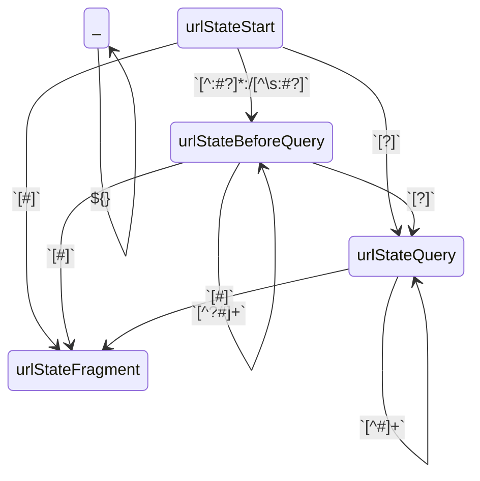

# Safe HTML

This module defines contextual auto-escaping tags for HTML, safe
content types, so that frameworks and Temper string expressions can
safely combine trusted HTML with untrusted .

    test("hello world, html style") {
      assert(html"Hello, <b>${"World"}</b>!".toString() ==
                 "Hello, <b>World</b>!");
    }

**The `html` tag** identifies the content as HTML, and auto-escapes
interpolated values.

    test("autoescaped") {
      assert(html"1 + 1 ${"<"} 3.".toString() ==
                 "1 + 1 &lt; 3.");
    }

**Context** matters because languages embed.
HTML can contain strings in micro-languages: URLs, JavaScript, CSS.

If we allowed any attacker-controlled URL as the value of an `href` attributes
then the attacker can simply use a `javascript:` URL to execute arbitrary
JavaScript.  Instead, if the interpolation is the first in a URL, we do additional
filtering.

    test("context matters -- URLs embed") {
      let okUrl(): String { "https://example.com/isn't-a-problem" }
      let evilUrl(): String { "javascript:alert('evil done')" }

      // https URLs are fine in an href attribute.  As an HTML text node, they're just any other string.
      assert(html"<a href='${okUrl()}'>${okUrl()}</a>".toString() ==
                 "<a href='https://example.com/isn&#39;t-a-problem'>https://example.com/isn&#39;t-a-problem</a>");

      // javascript URLs are not ok as string inputs.
      assert(html"<a href='${evilUrl()}'>${evilUrl()}</a>".toString() ==
                 "<a href='about:zz_Temper_zz#'>javascript:alert(&#39;evil done&#39;)</a>");
      //                   ┗━━━━━━━━━━━━━━━━━┛  ┗━━━━━━━━━━━━━━━━━━━━━━━━━━━━━━━━━━━┛
      //                  href attrib context            text node context
    }

Sometimes **adjustments are necessary**.  Here, an attribute value is
interpolated with and without quotation marks.  Unquoted attributes
values are legal HTML, but we can significantly reduce the attack
surface by consistently quoting attributes.

    test("quote adjustments") {
      let className = 'some-class';

      assert(html"

".toString()
             ==  "

");
    }

**Type safe exceptions**.  Here, `love` is a *SafeHtml* value with
tags, so it composes nicely (no overescaping) when injected in a tag
context.  But in an attribute context, the `html` tag takes care to
preserve attribute boundaries.

    test("safehtml injected in tag and attribute context") {
      let love = html"I <3 <b>Ponies</b>!";
      assert(html"<b>${love}</b>".toString() ==
                 "<b>I &lt;3 <b>Ponies</b>!</b>");
      //                     ┗━┛ No over-escaping                ┗━━━━━━━┛ Tags not allowed here are defanged.
    }

Composition libraries work with multi-line string expressions.

    test("looping inside an HTML expression") {
      let items = ["One", "<Two>", "Three"];
      let got: SafeHtml = html"""
        "<ul>
        "  {: for (let item of items) { :}
        "  <li>${item}</li>
        "  {: } :}
        "</ul>
        ;
      assert(
        got.text ==
        """
          "<ul>
          "  <li>One</li>
          "  <li>&lt;Two&gt;</li>
          "  <li>Three</li>
          "</ul>
        );
    }

## Context type definitions

HtmlEscaperContext represents a path into an HTML grammar that allows pausable
parsing of HTML with holes.

    export class HtmlEscaperContext(

htmlState describes where the parser is in the HTML parsing algorithm.

      public htmlState: Int32,

tagState describes any special tag the HTML parser is in.
For example, inside a tag, it describes that tag.
In the body of a special tag, e.g. `` exits the special element.

      public tagState: Int32,

attribState describes the kind of attribute being parsed.
For example, for `src="..."` we might need to know that the `...` is a URL embedded
in HTML, or in `onclick="..."` that the value is JavaScript embedded in HTML.

      public attribState: Int32,

delimState identifies the kind of quotation mark for the current attribute value.

      public delimState: Int32,

    ) extends Context {
      public toString(): String {
        "HtmlEscaperContext(${htmlStateStr(htmlState)}, ${tagStateStr(tagState)}, ${attribStateStr(attribState)}, ${delimStateStr(delimState)})"
      }
    }

Our initial HtmlEscaperContext just has zeroes/empties for everything.

JsEscaperContext tracks parsing in trusted JavaScript.

    class JsEscaperContext(

jsState allows for streaming parsing of JavaScript in script elements
and event handler attributes.  This state requires being able to track
whether a `/` starts a regular expression or a division operator.

The jsState tracks states in the [JS2.0 lexical grammar][js20-lexer-grammar],
adjusted to deal with more modern constructs like backtick strings.
That lexical grammar was an experiment. It is approximate but highly accurate,
and sufficient since our threat model excludes obfuscated, trusted string parts.
*jsState* captures the kind of token we're in along with the (re, div, unit) bits.

      public jsState: Int32,

jsStack provides additional JavaScript parsing context.  Handling
nested interpolations in backtick strings requires knowing whether a
`}` ends an interpolation or is a regular token.

      public jsStack: List<Boolean>,
    ) extends Context {
      public toString(): String { "JsEscaperContext(${jsState})" }
    }

CssEscaperContext captures enough state to allow safe inerpolation
into `<style>` element bodies and `style=` attribute values.

    class CssEscaperContext(
      public cssState: Int32,
    ) extends Context {
      public toString(): String { "CssEscaperContext(${cssState})" }
    }

UrlEscaperContext captures enough state to allow safe interpolation
into attribute values that have URL content.
It allows distinguishing between interpolations:

- at the start of a URL where attacker content may control the scheme
- into a path part where interpolations control path resolution
- into a query parameter where `=` and `&` are significant meta-characters
- into a fragment

The exact escaper chosen allows for high quality of service in URL composition.

    export class UrlEscaperContext(
      public urlState: Int32,
    ) extends Context {
      public toString(): String { "UrlEscaperContext(${urlStateStr(urlState)})" }
    }

These constants have names prefixed with the state they control.

Here are the possible html state values.

    /** Not in a tag */
    let htmlStatePcdata = 0;
    /** In an open tag name, after `<`. */
    let htmlStateOName = 1;
    /** In a close tag name, after `</`. */
    let htmlStateCName = 2;
    /** In an open tag, separated from the tag name or preceding attribute value. */
    let htmlStateBeforeAttr = 3;
    /** In an open tag, saw an attribute name, but not the `=`. */
    let htmlStateBeforeEq = 4;
    /** In an open tag, saw an attribute name and the `=`. */
    let htmlStateBeforeValue = 5;
    /** In an attribute value.  The delimState specifies the kind of delimiter and the exit conditions. */
    let htmlStateAttr = 6;
    /** After an attribute value including any close delimiter. This state does some cleanup and auto-transitions to another. */
    let htmlStateAfterAttr = 7;
    /**
     * In a context where we're handling the body of a special tag,
     * specified by tagState, and need to look for its special exit condition.
     * For example, `</script>` exits a `<script>` element body.
     */
    let htmlStateSpecialBody = 8;

    /** An attribute with no specific content type */
    let attribStateGeneric = 0;
    /** An attribute whose value requires CSS processing */
    let attribStateCss = 1;
    /** An attribute whose value requires Js processing */
    let attribStateJs = 2;
    /** An attribute whose value requires URL processing */
    let attribStateUrl = 3;
    /** An attribute whose value requires processing as a comma-separated list of URLs */
    let attribStateUrls = 4;

    /**
     * An unquoted attribute which we insert double quotes around to reduce the attack surface.
     * E.g. ``
     */
    let delimStateUq = 0;
    /** A double quoted attribute. E.g. `` */
    let delimStateSq = 1;
    /** A single quoted attribute. E.g. `` */
    let delimStateDq = 2;

    /**
     * The state at the start of a URL. Attackers who can inject content here may control the protocol.
     * A common technique is to inject `javascript:badCode()#`, so interpolations here are more heavily
     * filtered than other locations in the URL.
     */
    let urlStateStart = 0;
    /**
     * The state in a URL before a `?` or `#` have been seen.
     * Interpolations here might be URL prefixes with their own queries or fragments,
     * but may just be path parts.
     */
    let urlStateBeforeQuery = 1;
    /**
     * The state in a URL after a `?` has been seen in a trusted portion, but before
     * any `#` has been seen.  Interpolations here are assumed to be query parameter
     * parts, so URL metacharacters (`&`, `#`, `+`, and `%`) are percent-escaped.
     *
     * TODO: An inerpolated iterable of pairs may be encoded as a series of separate URL
     * key-value pairs.
     */
    let urlStateQuery = 2;
    /**
     * The state in a URL after a `#` has been seen in a trusted portion.
     * There are no agreed upon conventions for encoding structured data in a fragment,
     * but we do encoding similar to the query part.
     */
    let urlStateFragment = 3;

## The `html` tag

html is a tag for string expressions that applies contextual auto-escaping to untrusted
expressions to render them safe.  It embeds knowledge of HTML and nesting languages to
provide a much higher level of safety than na&iuml;ve auto-escaping.

    export let html = SafeHtmlBuilder;

SafeHtml is a string wrapper for HTML text that is trusted.
It should only be constructed when it is known safe by construction.
For example, the auto-escaping HTML tag produces it, but it may be created by other reliable sources:
e.g. an escaping function that defangs all HTML meta-characters, and a carefully reviewed HTML sanitizer.

    export class SafeHtml(public text: String) {
      public toString(): String { text }
    }

SafeUrl is a string wrapper for URL content that is trusted.
It should only be constructed when it is known safe by construction.

    export class SafeUrl(public text: String) {
      public toString(): String { text }
    }

## Picking escapers

    export sealed interface HtmlEscaper extends Escaper {
      @overload("apply")
      applySafeHtml(x: SafeHtml): String;
      @overload("apply")
      applySafeUrl(x: SafeUrl): String;
      @overload("apply")
      applyInt32(x: Int32): String;
      @overload("apply")
      applyInt64(x: Int64): String;
      @overload("apply")
      applyFloat64(x: Float64): String;
      @overload("apply")
      applyString(x: String): String;
    }

    /** Defangs interpolations in weird locations.  TODO: These should be reported at compile time. */
    export class OutputHtmlSpaceEscaper extends HtmlEscaper {
      public static instance = new OutputHtmlSpaceEscaper();
      @overload("apply")
      public applySafeHtml(x: SafeHtml): String { " " }
      @overload("apply")
      public applySafeUrl(x: SafeUrl): String { " " }
      @overload("apply")
      public applyInt32(x: Int32): String { " " }
      @overload("apply")
      public applyInt64(x: Int64): String { " " }
      @overload("apply")
      public applyFloat64(x: Float64): String { " " }
      @overload("apply")
      public applyString(x: String): String { " " }
    }
    let outputHtmlSpaceEscaper = doPure { (): OutputHtmlSpaceEscaper => new OutputHtmlSpaceEscaper() };

    /** Encodes HTML meta-characters using HTML entities in a way that preserves tag boundaries. */
    export class HtmlPcdataEscaper extends HtmlEscaper {
      public static instance = new HtmlPcdataEscaper();
      @overload("apply")
      public applySafeHtml(x: SafeHtml): String { x.toString() }
      @overload("apply")
      public applySafeUrl(x: SafeUrl): String { applyString(x.text) }
      @overload("apply")
      public applyInt32(x: Int32): String { applyString(x.toString()) }
      @overload("apply")
      public applyInt64(x: Int64): String { applyString(x.toString()) }
      @overload("apply")
      public applyFloat64(x: Float64): String { applyString(x.toString()) }
      @overload("apply")
      public applyString(x: String): String { htmlCodec.encode(x) }
    }
    let htmlPcdataEscaper = doPure { (): HtmlPcdataEscaper => new HtmlPcdataEscaper() };

    /** Encodes HTML meta-characters using HTML entities in a way that preserves attribute boundaries. */
    export class HtmlAttributeEscaper extends HtmlEscaper {
      public static instance = new HtmlAttributeEscaper();
      @overload("apply")
      public applySafeHtml(x: SafeHtml): String { applyString(htmlCodec.decode(x.text)) }
      @overload("apply")
      public applySafeUrl(x: SafeUrl): String { applyString(x.text) }
      @overload("apply")
      public applyInt32(x: Int32): String { applyString(x.toString()) }
      @overload("apply")
      public applyInt64(x: Int64): String { applyString(x.toString()) }
      @overload("apply")
      public applyFloat64(x: Float64): String { applyString(x.toString()) }
      @overload("apply")
      public applyString(x: String): String { htmlCodec.encode(x) }
    }
    let htmlAttributeEscaper = doPure { (): HtmlAttributeEscaper => new HtmlAttributeEscaper() };

    export let pickHtmlEscaper(stateBefore: AutoescState<HtmlEscaperContext>): HtmlEscaper {
      var escaper: HtmlEscaper = when (stateBefore.context.htmlState) {
        htmlStatePcdata -> htmlPcdataEscaper;
        htmlStateOName, htmlStateCName, htmlStateBeforeAttr, htmlStateBeforeEq, htmlStateAfterAttr -> outputHtmlSpaceEscaper;
        htmlStateBeforeValue -> panic(); // We should have shifted into an unquoted attribute state
        htmlStateAttr -> htmlAttributeEscaper;
        htmlStateSpecialBody -> outputHtmlSpaceEscaper; // TODO
        else -> panic();
      }
      let subsidiary = stateBefore.subsidiary;
      if (subsidiary != null) {
        let delegate = (subsidiary.delegate as HtmlDelegate) orelse panic();
        delegate.escaper(escaper)
      } else {
        escaper
      }
    }

    export class HtmlEscaperPicker extends EscaperPicker<HtmlEscaperContext, HtmlEscaper> {
      public escaperFor(stateBefore: AutoescState<HtmlEscaperContext>): HtmlEscaper {
        pickHtmlEscaper(stateBefore)
      }
    }

## Transition tables

These tables define automata that can progressively parse a stream of
chunks in a language and propagate contexts.  From a context, we can
propagate context across safe chunks and the escaper pickers know how
to pick an escaper for untrusted content.

The transition tables define context propagation function.  Sometimes
one language embeds another, and these tables also capture when one
automaton pushes a subsidiary for a nested language, how it feeds it
content, and when a subsidiary is retired at the end of a nesting
region.

### HTML Transition table

<!-- TRANSITION_TABLE: Html; htmlState, tagState, attribState, delimState -->

| In                    | Regex                                     | Substitution | Out                                                 |
| --------------------- | ----------------------------------------- | ------------ | -------------------------------------------------   |
| Pcdata,      _, _, _  | `<\/(?=[a-zA-Z])`                         |              | CName,       _, _,   _                              |
| Pcdata,      _, _, _  | `<(?=[a-zA-Z])`                           |              | OName,       _, _,   _                              |
| Pcdata,      _, _, _  | `<`                                       | `&lt;`       | _,           _, _,   _                              |
| Pcdata,      _, _, _  | `>`                                       | `&gt;`       | _,           _, _,   _                              |
| Pcdata,      _, _, _  | `[^<>]+`                                  |              | _,           _, _,   _                              |
| CName,       _, _, _  | `"[^"]*"?`                                |              | _,           _, _,   _                              |
| CName,       _, _, _  | `'[^']*'?`                                |              | _,           _, _,   _                              |
| CName,       _, _, _  | `[^>]`                                    |              | _,           _, _,   _                              |
| CName,       _, _, _  | `>`                                       |              | Pcdata,      _, _,   _                              |
| OName,       _, _, _  | `[a-zA-Z][a-zA-Z0-9:\-]*`                 |              | _,           _, _,   _                              |
| OName,       _, _, _  | `(?=>)`                                   |              | BeforeAttr,  _, _,   _                              |
| OName,       _, _, _  | `\s+`                                     |              | BeforeAttr,  _, _,   _                              |
| BeforeAttr,  _, _, _  | `\s+`                                     |              | _,           _, _,   _                              |
| BeforeAttr,  _, _, _  | `[a-zA-Z0-9\-]+:`                         |              | _,           _, _,   _                              |
| BeforeAttr,  _, _, _  | `(?i)(?:srcset)(?![a-z0-9:\-])`           |              | BeforeEq,    _,Urls, _; push(Url, htmlCodec)        |
| BeforeAttr,  _, _, _  | `(?i)(?:src/href)(?![a-z0-9:\-])`         |              | BeforeEq,    _,Url,  _; push(Url, htmlCodec)        |
| BeforeAttr,  _, _, _  | `(?i)data-[^=\s>]*ur[li][^=\s>]*`         |              | BeforeEq,    _,Url,  _; push(Url, htmlCodec)        |
| BeforeAttr,  _, _, _  | `(?i)style(?![a-z0-9:\-])`                |              | BeforeEq,    _,Css,  _; push(Css, htmlCodec)        |
| BeforeAttr,  _, _, _  | `(?i)on[^=\s>]*`                          |              | BeforeEq,    _,Js,   _; push(Js,  htmlCodec)        |
| BeforeAttr,  _, _, _  | `[^=>\s]+`                                |              | BeforeEq,    _, _,   _                              |
| BeforeEq,    _, _, _  | `\s+`                                     |              | _,           _, _,   _                              |
| BeforeEq,    _, _, _  | `=`                                       |              | BeforeValue, _, _,   _                              |
| BeforeEq,    _, _, _  | `(?=\s*\/?>)`                             |              | AfterAttr,   _, _,   _                              |
| BeforeValue, _, _, _  | `"`                                       |              | Attr,        _, _,   Dq                             |
| BeforeValue, _, _, _  | `'`                                       |              | Attr,        _, _,   Sq                             |
| BeforeValue, _, _, _  | `(?=[^>\s])`                              | `"`          | Attr,        _, _,   Uq                             |
| BeforeValue, _, _, _  | ${}                                       | `"`          | Attr,        _, _,   Uq                             |
| Attr,        _, _, Uq | `(?=[>\s])`                               | `"`          | AfterAttr,   _, _,   0                              |
| Attr,        _, _, Dq | `"`                                       |              | AfterAttr,   _, _,   0                              |
| Attr,        _, _, Sq | `'`                                       |              | AfterAttr,   _, _,   0                              |
| Attr,        _,Urls,_ | `,`                                       |              | _,           _, _,   _; pop(); push(Url, htmlCodec) |
| Attr,        _, _, Uq | `[^>\s"]+`                                |              | _,           _, _,   _; feed()                      |
| Attr,        _, _, Uq | `"`                                       | `&#34;`      | _,           _, _,   _; feed()                      |
| Attr,        _, _, Dq | `[^"]+`                                   |              | _,           _, _,   _; feed()                      |
| Attr,        _, _, Sq | `[^']+`                                   |              | _,           _, _,   _; feed()                      |
| Attr,        _, 0, _  | ${}                                       |              | _,           _, _,   _                              |
| Attr,        _, _, _  | ${}                                       |              | _,           _, _,   _; feed()                      |
| AfterAttr,   _, 0, _  |                                           |              | BeforeAttr,  _, _,   _                              |
| AfterAttr,   _, _, _  |                                           |              | BeforeAttr,  _, 0,   _; pop()                       |
| BeforeAttr,  _, _, _  | `>`                                       |              | Pcdata,      _, _,   _                              |
| _,           _, _, _  | ${}                                       |              | _,           _, _,   _                              |

```mermaid
stateDiagram-v2
  state "htmlStatePcdata" as htmlStatePcdata
  state "htmlStateCName" as htmlStateCName
  htmlStatePcdata --> htmlStateCName: #96;<\/(?=[a-zA-Z])#96;
  state "htmlStateOName" as htmlStateOName
  htmlStatePcdata --> htmlStateOName: #96;<(?=[a-zA-Z])#96;
  htmlStatePcdata --> htmlStatePcdata: #96;<#96;\n#96;&lt;#96;
  htmlStatePcdata --> htmlStatePcdata: #96;>#96;\n#96;&gt;#96;
  htmlStatePcdata --> htmlStatePcdata: #96;[^<>]+#96;
  htmlStateCName --> htmlStateCName: #96;"[^"]*"?#96;
  htmlStateCName --> htmlStateCName: #96;'[^']*'?#96;
  htmlStateCName --> htmlStateCName: #96;[^>]#96;
  htmlStateCName --> htmlStatePcdata: #96;>#96;
  htmlStateOName --> htmlStateOName: #96;[a-zA-Z][a-zA-Z0-9#58;\-]*#96;
  state "htmlStateBeforeAttr" as htmlStateBeforeAttr
  htmlStateOName --> htmlStateBeforeAttr: #96;(?=>)#96;
  htmlStateOName --> htmlStateBeforeAttr: #96;\s+#96;
  htmlStateBeforeAttr --> htmlStateBeforeAttr: #96;\s+#96;
  htmlStateBeforeAttr --> htmlStateBeforeAttr: #96;[a-zA-Z0-9\-]+#58;#96;
  state "htmlStateBeforeEq" as htmlStateBeforeEq
  htmlStateBeforeAttr --> htmlStateBeforeEq: #96;(?i)(?#58;srcset)(?![a-z0-9#58;\-])#96;
  htmlStateBeforeAttr --> htmlStateBeforeEq: #96;(?i)(?#58;src/href)(?![a-z0-9#58;\-])#96;
  htmlStateBeforeAttr --> htmlStateBeforeEq: #96;(?i)data-[^=\s>]*ur[li][^=\s>]*#96;
  htmlStateBeforeAttr --> htmlStateBeforeEq: #96;(?i)style(?![a-z0-9#58;\-])#96;
  htmlStateBeforeAttr --> htmlStateBeforeEq: #96;(?i)on[^=\s>]*#96;
  htmlStateBeforeAttr --> htmlStateBeforeEq: #96;[^=>\s]+#96;
  htmlStateBeforeEq --> htmlStateBeforeEq: #96;\s+#96;
  state "htmlStateBeforeValue" as htmlStateBeforeValue
  htmlStateBeforeEq --> htmlStateBeforeValue: #96;=#96;
  state "htmlStateAfterAttr" as htmlStateAfterAttr
  htmlStateBeforeEq --> htmlStateAfterAttr: #96;(?=\s*\/?>)#96;
  state "htmlStateAttr" as htmlStateAttr
  htmlStateBeforeValue --> htmlStateAttr: #96;"#96;
  htmlStateBeforeValue --> htmlStateAttr: #96;'#96;
  htmlStateBeforeValue --> htmlStateAttr: #96;(?=[^>\s])#96;\n#96;"#96;
  htmlStateBeforeValue --> htmlStateAttr: ${}\n#96;"#96;
  htmlStateAttr --> htmlStateAfterAttr: #96;(?=[>\s])#96;\n#96;"#96;
  htmlStateAttr --> htmlStateAfterAttr: #96;"#96;
  htmlStateAttr --> htmlStateAfterAttr: #96;'#96;
  htmlStateAttr --> htmlStateAttr: #96;,#96;
  htmlStateAttr --> htmlStateAttr: #96;[^>\s"]+#96;
  htmlStateAttr --> htmlStateAttr: #96;"#96;\n#96;&#35;34;#96;
  htmlStateAttr --> htmlStateAttr: #96;[^"]+#96;
  htmlStateAttr --> htmlStateAttr: #96;[^']+#96;
  htmlStateAttr --> htmlStateAttr: ${}
  htmlStateAttr --> htmlStateAttr: ${}
  htmlStateAfterAttr --> htmlStateBeforeAttr
  htmlStateAfterAttr --> htmlStateBeforeAttr
  htmlStateBeforeAttr --> htmlStatePcdata: #96;>#96;
  state "_" as _
  _ --> _: ${}
```

<!-- /TRANSITION_TABLE -->

<!-- GENERATED_TRANSITION_DIAGRAM: Html; htmlState -->

<!-- /GENERATED_TRANSITION_DIAGRAM -->

### URL Transition table

<!-- TRANSITION_TABLE: Url; urlState -->

| In                    | Regex                | Substitution | Out         |
| --------------------- | -------------------- | ------------ | ----------- |
| Start                 | `[^:#?]*:/[^\s:#?]`  |              | BeforeQuery |
| Start                 | `[?]`                |              | Query       |
| Start                 | `[#]`                |              | Fragment    |
| BeforeQuery           | `[^?#]+`             |              | _           |
| BeforeQuery           | `[?]`                |              | Query       |
| BeforeQuery           | `[#]`                |              | Fragment    |
| Query                 | `[^#]+`              |              | _           |
| Query                 | `[#]`                |              | Fragment    |
| _                     | ${}                  |              | _           |

<!-- /TRANSITION_TABLE -->

<!-- GENERATED_TRANSITION_DIAGRAM: Url; urlState -->

<!-- /GENERATED_TRANSITION_DIAGRAM -->

## Autoescaping builder implementation

    export class SafeHtmlBuilder extends ContextualAutoescapingAccumulator<HtmlEscaperContext, HtmlEscaper> {
      public static newCollector(): StringBuilder { new StringBuilder() }
      public static initialState(): AutoescState<HtmlEscaperContext> { new AutoescState(new HtmlEscaperContext(0, 0, 0, 0), null) }
      public static propagator(): HtmlContextPropagator { new HtmlContextPropagator() }
      public static picker(): EscaperPicker<HtmlEscaperContext, HtmlEscaper> { new HtmlEscaperPicker() }
      public static fromCollector(collector: StringBuilder): SafeHtml {
        new SafeHtml(collector.toString())
      }
      public static mergeStates(a: AutoescState<HtmlEscaperContext>, b: AutoescState<HtmlEscaperContext>): AutoescState<HtmlEscaperContext> {
        // TODO
        a
      }

      private var _state: AutoescState<HtmlEscaperContext> = SafeHtmlBuilder.initialState();
      private collector: StringBuilder = SafeHtmlBuilder.newCollector();

      protected get state(): AutoescState<HtmlEscaperContext> { this._state }
      protected set state(x: AutoescState<HtmlEscaperContext>): Void { this._state = x; }
      public get escaperPicker(): EscaperPicker<HtmlEscaperContext, HtmlEscaper> { SafeHtmlBuilder.picker() }
      public get contextPropagator(): ContextPropagator<HtmlEscaperContext> { SafeHtmlBuilder.propagator() }

      public get accumulated(): SafeHtml {
        SafeHtmlBuilder.fromCollector(collector)
      }

      protected collectFixed(fixed: String): Void {
        collector.append(fixed);
      }

      @overload("append")
      public appendSafeHtml(x: SafeHtml): Void {
        collector.append(this.prepareForAppend().applySafeHtml(x));
      }
      @overload("append")
      public appendSafeUrl(x: SafeUrl): Void {
        collector.append(this.prepareForAppend().applySafeUrl(x));
      }
      @overload("append")
      public appendInt32(x: Int32): Void {
        collector.append(this.prepareForAppend().applyInt32(x));
      }
      @overload("append")
      public appendInt64(x: Int64): Void {
        collector.append(this.prepareForAppend().applyInt64(x));
      }
      @overload("append")
      public appendFloat64(x: Float64): Void {
        collector.append(this.prepareForAppend().applyFloat64(x));
      }
      @overload("append")
      public appendString(x: String): Void {
        collector.append(this.prepareForAppend().applyString(x));
      }
    }

## Delegation

The HTML autoescaper needs to delegate to auto-escapers that nest within HTML.

    export sealed interface HtmlDelegate extends Delegate {
      escaper(outer: HtmlEscaper): HtmlEscaper;
    }

    export class HtmlUrlDelegate extends ContextDelegate<UrlEscaperContext> & HtmlDelegate {
      private var _state: AutoescState<UrlEscaperContext> = new AutoescState<UrlEscaperContext>(new UrlEscaperContext(0), null);
      private var _subsidiary: Subsidiary? = null;

      protected get state(): AutoescState<UrlEscaperContext> { _state }
      protected set state(x: AutoescState<UrlEscaperContext>): Void { _state = x; }

      protected get contextPropagator(): ContextPropagator<UrlEscaperContext> {
        urlContextPropagator
      }

      public escaper(outer: HtmlEscaper): HtmlEscaper {
        when (state.context.urlState) {
          urlStateStart -> new HtmlUrlEscaperAdapter(htmlProtocolFilteringUrlEscaper, outer);
          urlStateBeforeQuery -> new HtmlUrlEscaperAdapter(htmlUrlPartUrlEscaper, outer);
          urlStateQuery, urlStateFragment -> new HtmlUrlEscaperAdapter(htmlAsIfQueryUrlEscaper, outer);
          else -> panic();
        }
      }
    }

    export class HtmlUrlEscaperAdapter(
      public first: UrlEscaper,
      public second: HtmlEscaper,
    ) extends HtmlEscaper {
      @overload("apply")
      public applySafeHtml(x: SafeHtml): String {
        second.applySafeUrl(first.applyString(x.text))
      }
      @overload("apply")
      public applySafeUrl(x: SafeUrl): String {
        second.applySafeUrl(first.applySafeUrl(x))
      }
      @overload("apply")
      public applyInt32(x: Int32): String {
        second.applySafeUrl(first.applyString(x.toString()))
      }
      @overload("apply")
      public applyInt64(x: Int64): String {
        second.applySafeUrl(first.applyString(x.toString()))
      }
      @overload("apply")
      public applyFloat64(x: Float64): String {
        second.applySafeUrl(first.applyString(x.toString()))
      }
      @overload("apply")
      public applyString(x: String): String {
        second.applySafeUrl(first.applyString(x))
      }
    }

    export sealed interface UrlEscaper extends Escaper {
      @overload("apply")
      applySafeUrl(x: SafeUrl): SafeUrl;
      @overload("apply")
      applyString(x: String): SafeUrl;
    }

    let protocolAllowList = rgx"^(?:[Hh][Tt][Tt][Pp][Ss]?|[Mm][Aa][Ii][Ll][Tt][Oo])$";
    let fallbackSafeUrl = new SafeUrl("about:zz_Temper_zz#");

    export class HtmlProtocolFilteringUrlEscaper extends UrlEscaper {
      public static instance = new HtmlProtocolFilteringUrlEscaper();
      @overload("apply")
      public applySafeUrl(x: SafeUrl): SafeUrl { x }
      @overload("apply")
      public applyString(x: String): SafeUrl {
        var protocolEnd = String.begin;
        let end = x.end;
        while (protocolEnd < end) {
          let cp = x[protocolEnd];
          if (cp == char':') {
            let protocol = x.slice(String.begin, protocolEnd);
            return if ((protocolAllowList.find(protocol) orelse null) != null) {
              // Protocol is explicitly allowed
              new SafeUrl(x)
            } else {
              fallbackSafeUrl
            }
          }
          protocolEnd = x.next(protocolEnd);
        }
        // No protocol, just process it as a string content.
        htmlUrlPartUrlEscaper.applyString(x)
      }
    }
    let htmlProtocolFilteringUrlEscaper = doPure { (): HtmlProtocolFilteringUrlEscaper =>
      new HtmlProtocolFilteringUrlEscaper()
    };

    /**
     * We %-escape every ASCII codepoint but
     * - letters and digits [A-Za-z0-9]
     * - path separators, dots, dashes, underscores
     */
    let urlQuerySafe: List = do {
      let lb = new ListBuilder<Boolean>();
      for (var i = 0; i < 128; ++i) {
        lb.add(
          i == char'/' || i == char'.' || i == char'-' || i == char'_' ||
          char'0' <= i && i <= char'9' || char'a' <= (i | 32) && (i | 32) <= char'z'
        );
      }
      lb.toList()
    };
    /**
     * Outside of a query or fragment we also allow common HTML metacharacters: ':', '?', '#', '&'.
     * That allows embedding full URL prefixes in a string.
     */
    let urlSafe: List<Boolean> = do {
      let lb = new ListBuilder<Boolean>();
      for (var i = 0; i < 128; ++i) {
        lb.add(
          urlQuerySafe[i] || i == char':' || i == char'?' || i == char'#' || i == char'&'
        );
      }
      lb.toList()
    }

    export class HtmlUrlPartUrlEscaper extends UrlEscaper {
      public static instance = new HtmlUrlPartUrlEscaper();
      @overload("apply")
      public applySafeUrl(x: SafeUrl): SafeUrl { x }
      @overload("apply")
      public applyString(x: String): SafeUrl {
        var i = String.begin;
        let end = x.end;
        var emitted = String.begin;
        let sb = new StringBuilder();
        while (i < end) {
          let cp = x[i];
          if (cp < urlSafe.length && !urlSafe[cp]) {
            sb.appendBetween(x, emitted, i);
            percentEscapeOctetTo(cp, sb);
            emitted = x.next(i);
          }
          i = x.next(i);
        }
        new SafeUrl(
          if (emitted > String.begin) {
            sb.appendBetween(x, emitted, end);
            sb.toString()
          } else {
            x
          }
        )
      }
    }
    let htmlUrlPartUrlEscaper = doPure { (): HtmlUrlPartUrlEscaper => new HtmlUrlPartUrlEscaper() };

    export class HtmlAsIfQueryUrlEscaper extends UrlEscaper {
      public static instance = new HtmlAsIfQueryUrlEscaper();
      @overload("apply")
      public applySafeUrl(x: SafeUrl): SafeUrl { x }
      @overload("apply")
      public applyString(x: String): SafeUrl {
        var i = String.begin;
        let end = x.end;
        var emitted = String.begin;
        let sb = new StringBuilder();
        while (i < end) {
          let cp = x[i];
          if (cp < urlQuerySafe.length && !urlQuerySafe[cp]) {
            sb.appendBetween(x, emitted, i);
            percentEscapeOctetTo(cp, sb);
            emitted = x.next(i);
          }
          i = x.next(i);
        }
        new SafeUrl(
          if (emitted > String.begin) {
            sb.appendBetween(x, emitted, end);
            sb.toString()
          } else {
            x
          }
        )
      }
    }
    let htmlAsIfQueryUrlEscaper = doPure { (): HtmlAsIfQueryUrlEscaper => new HtmlAsIfQueryUrlEscaper() };

    export class HtmlCssDelegate extends HtmlDelegate {
      public process(s: String?): String { /* TODO */ s ?? "" }
      public escaper(outer: HtmlEscaper): HtmlEscaper? { /* TODO */ outer }
    }

    export class HtmlJsDelegate extends HtmlDelegate {
      public process(s: String?): String { /* TODO */ s ?? "" }
      public escaper(outer: HtmlEscaper): HtmlEscaper? { /* TODO */ outer }
    }

## Corner cases

    test("double quotes in attribute value with inserted quotes") {
      assert(
          html"""
            "

            .text
          == '
');
    }

## Dependencies

We need regular expressions for finding transitions in the context propagation functions.

    let { ... } = import("std/regex");

The core definitions include a lot of bundling types and also machinery like Delegate.

    let { ... } = import("../core");

Some URL escaping utilities from the URL codec come in handy for escaping URLs in HTML.

    let { percentEscapeOctetTo } = import("../url");

[js20-lexer-grammar]: https://www-archive.mozilla.org/js/language/js20-2000-07/formal/lexer-grammar
