# CSS Delegate

*SafeCss* is a value that is known to contain CSS text constructed by safe means.

    export class SafeCss(public text: String) {
      public toString(): String { text }
    }

HtmlCssDelegate processes CSS inside contexts like `
` and ``.

    export class HtmlCssDelegate extends ContextDelegate<CssEscaperContext, HtmlEscaper> & HtmlDelegate {
      private var _state: AutoescState<CssEscaperContext, HtmlEscaper> = new AutoescState<CssEscaperContext, HtmlEscaper>(new CssEscaperContext(0, 0), null);

      public get state(): AutoescState<CssEscaperContext, HtmlEscaper> { _state }
      public set state(x: AutoescState<CssEscaperContext, HtmlEscaper>): Void { _state = x; }
      public get sameState(): fn (AutoescState<CssEscaperContext, HtmlEscaper>, AutoescState<CssEscaperContext, HtmlEscaper>): Boolean {
        cssStatesEqual
      }

      public get contextPropagator(): ContextPropagator<CssEscaperContext, HtmlEscaper> {
        cssContextPropagator
      }

      public escaper(outer: HtmlEscaper): HtmlEscaper {
        let state = this.state;
        let cssEscaper: CssEscaper = when (state.context.cssState) {
          cssStateTop -> cssAtomEscaper;
          cssStateQuoted -> cssStrPartEscaper;
          cssStateComment -> cssSpaceEscaper;
          cssStateHash -> cssAtomEscaper;
          cssStateBeforeUrl -> panic(); // Transition should have moved to Url
          cssStateUrl -> cssStrPartEscaper; // Just deal with the url escaper output
          cssStateAfterUrl -> panic(); // We should have moved to Top during preparation
          else -> panic();
        }
        let escaper = new HtmlCssEscaperAdapter(cssEscaper, outer);
        let subsidiary = state.subsidiary;
        if (subsidiary != null) {
          subsidiary.delegate.escaper(escaper) orelse panic()
        } else {
          escaper
        }
      }

      public toString(): String {
        "HtmlCssDelegate(${_state})"
      }
    }

CssEscaperContext captures enough state to allow safe interpolation
into `<style>` element bodies and `style=` attribute values.

    export class CssEscaperContext(
      public cssState: Int32,
      public cssDelim: Int32,
    ) extends Context {
      public toString(): String { "CssEscaperContext(${cssStateStr(cssState)}, ${cssDelimStr(cssDelim)})" }
    }

The CSS state constants define a state machine for parsing CSS.

    /** A top level initial CSS state */
    let cssStateTop = 0;
    /** Inside a quoted string.  The delim variable specifies the kind. */
    let cssStateQuoted = 1;
    /** Inside a CSS comment. A star slash comment like this one. */
    let cssStateComment = 2;
    /** Inside a run of CSS identifier characters after a `#` which can indicate an ID selector or a hexadecimal color. */
    let cssStateHash = 3;
    /** saw a `url(...)` start. */
    let cssStateBeforeUrl = 4;
    /** inside a `url(...)` context.  The delim variable specifies the kind of quote. */
    let cssStateUrl = 5;
    /** Allows for orderly transition out of the url state */
    let cssStateAfterUrl = 6;

    /** Unquoted.  Valid for non-string states and for urls. */
    let cssDelimUq = 0;
    /** Double-quoted (") */
    let cssDelimDq = 1;
    /** Single-quoted (') */
    let cssDelimSq = 2;

Just reuse the HTML Url delegate for CSS `url(...)` tokens.

    export let CssUrlDelegate = HtmlUrlDelegate;

## Escapers

CssAtomEscaper outputs a safe CSS token or token part.
Given a URL it will output a `url(...)` token, and given SafeCss it
will output it as is.

Given a string, the story is a bit more complicated.

It's much more common to want to output an identifier as part of a CSS
selector than as a quoted string, and putting quotes or url(...)
around an interpolation picks the right escaper for string content, so
here we assume x is part of an identifier like a tag/class/ID name.

This same scanning allows for outputting quantities like `32px`
unchanged.

    export sealed interface CssEscaper extends Escaper {
      @overload("apply")
      applySafeHtml(x: SafeHtml): SafeCss;
      @overload("apply")
      applySafeUrl(x: SafeUrl): SafeCss;
      @overload("apply")
      applySafeCss(x: SafeCss): SafeCss;
      @overload("apply")
      applySafeJs(x: SafeJs): SafeCss;
      @overload("apply")
      applyInt32(x: Int32): SafeCss;
      @overload("apply")
      applyInt64(x: Int64): SafeCss;
      @overload("apply")
      applyFloat64(x: Float64): SafeCss;
      @overload("apply")
      applyString(x: String): SafeCss;

      toString(): String;
    }

    export class CssAtomEscaper extends CssEscaper {
      public static instance: CssAtomEscaper = new CssAtomEscaper();
      @overload("apply")
      public applySafeHtml(x: SafeHtml): SafeCss {
        applyString(x.text)
      }
      @overload("apply")
      public applySafeUrl(x: SafeUrl): SafeCss {
        new SafeCss("url(\"${ encodeCss(x.text, safeInCssUrl) }\")")
      }
      @overload("apply")
      public applySafeCss(x: SafeCss): SafeCss {
        x
      }
      @overload("apply")
      public applySafeJs(x: SafeJs): SafeCss {
        applyString(x.toString())
      }
      @overload("apply")
      public applyInt32(x: Int32): SafeCss {
        applyString(x.toString())
      }
      @overload("apply")
      public applyInt64(x: Int64): SafeCss {
        applyString(x.toString())
      }
      @overload("apply")
      public applyFloat64(x: Float64): SafeCss {
        applyString(x.toString())
      }
      @overload("apply")
      public applyString(x: String): SafeCss {
        new SafeCss(normalizeCssAtom(x))
      }
      public toString(): String { "CssAtomEscaper" }
    }

    export let cssAtomEscaper: CssAtomEscaper = doPure { new CssAtomEscaper() };

HtmlCssEscaperAdapter chains together a CssEscaper and an HtmlEscaper in a form
that is compatible with HtmlEscaper.

    export class HtmlCssEscaperAdapter(
      public first: CssEscaper,
      public second: HtmlEscaper,
    ) extends HtmlEscaper {
      @overload("apply")
      public applySafeHtml(x: SafeHtml): String {
        second.applySafeCss(first.applyString(x.text))
      }
      @overload("apply")
      public applySafeUrl(x: SafeUrl): String {
        second.applySafeCss(first.applySafeUrl(x))
      }
      @overload("apply")
      public applySafeCss(x: SafeCss): String {
        second.applySafeCss(first.applySafeCss(x))
      }
      @overload("apply")
      public applySafeJs(x: SafeJs): String {
        second.applySafeCss(first.applySafeJs(x))
      }
      @overload("apply")
      public applyInt32(x: Int32): String {
        second.applySafeCss(first.applyString(x.toString()))
      }
      @overload("apply")
      public applyInt64(x: Int64): String {
        second.applySafeCss(first.applyString(x.toString()))
      }
      @overload("apply")
      public applyFloat64(x: Float64): String {
        second.applySafeCss(first.applyString(x.toString()))
      }
      @overload("apply")
      public applyString(x: String): String {
        second.applySafeCss(first.applyString(x))
      }

      public toString(): String { "HtmlCssEscaperAdapter(${first}, ${second})" }
    }

safeInCssAtom is a boolean for each ASCII codepoint indicating whether
its safe in a CSS atom.

    let safeInCssAtom: List<Boolean> = doPure {
      let bools = new ListBuilder<Boolean>();
      for (var i = 0; i < 128; ++i) {
        var ok = false;
        if (i == char'-' || i == char'_' || i == char'+' || i == char'.' || i == char'#' || i == char'!') {
          ok = true
        } else if (char'0' <= i && i <= char'9') {
          ok = true
        } else {
          let lcaseI = i | 32;
          ok = char'a' <= lcaseI && lcaseI <= char'z';
        }
        bools.add(ok);
      }
      bools.toList()
    };

safeInCssUrl indicates whether a codepoint is safe in the quoted
portion of a CSS `url("...")` token.

    let safeInCssUrl: List<Boolean> = doPure {
      let bools = new ListBuilder<Boolean>();
      for (var i = 0; i < 128; ++i) {
        var ok = false;
        if (i == char'/' || i == char':' || i == char'?' || i == char'=' || i == char'&' || i == char'%') {
          ok = true
        } else {
          ok = safeInCssAtom[i]
        }
        bools.add(ok);
      }
      bools.toList()
    };

    let encodeCss(x: String, safe: List<Boolean>): String {
      var sb: StringBuilder? = null;
      var upTo = String.begin;
      var i = String.begin;
      let end = x.end;
      while (i < end) {
        let c = x[i];
        let next = x.next(i);
        // Allow the union of name characters and numeric quantity characters through
        let ok = c >= 0xA0 || (c < safe.length && safe[c]);
        if (!ok) {
          let sbOrNull = sb;
          let sbNotNull = sbOrNull ?? new StringBuilder();
          sb = sbNotNull;
          sbNotNull.appendBetween(x, upTo, i);
          sbNotNull.append("\\");
          sbNotNull.append(c.toString(16));
          sbNotNull.append(" ");
          upTo = next;
        }
        i = next;
      }

      let finalSb = sb;
      if (finalSb == null) {
        x // Fast path
      } else {
        finalSb.appendBetween(x, upTo, x.end)
        finalSb.toString()
      }
    }

normalizeCssAtom takes a string and normalizes so that it will be
treated as one non-powerful token by the CSS grammar.

    export let normalizeCssAtom(x: String): String {
      encodeCss(x, safeInCssAtom)
    }

    test("normalizeCssAtom examples") {
      assert(normalizeCssAtom("") == "");
      assert(normalizeCssAtom("foo") == "foo");
      assert(normalizeCssAtom("-5px") == "-5px");
      assert(normalizeCssAtom("1.5em") == "1.5em");
      assert(normalizeCssAtom("+20ex") == "+20ex");
      // CSS color.
      assert(normalizeCssAtom("#aaffaa") == "#aaffaa");
      // CSS words.
      assert(normalizeCssAtom("!important") == "!important");
      // CSS ID selector and class selector
      assert(normalizeCssAtom("#my-id") == "#my-id");
      assert(normalizeCssAtom(".my-class") == ".my-class");
      // TODO: can we allow things like rgba(<NUMBERS-AND-COMMAS>)?
      // Dodgy
      assert(normalizeCssAtom("</style") == "\\3c \\2f style");
      assert(normalizeCssAtom("-->") == "--\\3e ");
      assert(normalizeCssAtom("<![CDATA[") == "\\3c !\\5b CDATA\\5b ");
      assert(normalizeCssAtom("]]>") == "\\5d \\5d \\3e ");
      assert(normalizeCssAtom("@") == "\\40 ");
    }

CssStrPartEscaper escapes content interpolated into the middle of a
quoted CSS string token.  For example `content: "foo/${ x }"`

    export class CssStrPartEscaper extends CssEscaper {
      public static instance: CssStrPartEscaper = new CssStrPartEscaper();
      @overload("apply")
      public applySafeHtml(x: SafeHtml): SafeCss {
        applyString(x.text)
      }
      @overload("apply")
      public applySafeUrl(x: SafeUrl): SafeCss {
        applyString(x.text)
      }
      @overload("apply")
      public applySafeCss(x: SafeCss): SafeCss {
        applyString(x.text)
      }
      @overload("apply")
      public applySafeJs(x: SafeJs): SafeCss {
        applyString(x.toString())
      }
      @overload("apply")
      public applyInt32(x: Int32): SafeCss {
        applyString(x.toString())
      }
      @overload("apply")
      public applyInt64(x: Int64): SafeCss {
        applyString(x.toString())
      }
      @overload("apply")
      public applyFloat64(x: Float64): SafeCss {
        applyString(x.toString())
      }
      @overload("apply")
      public applyString(x: String): SafeCss {
        // The safeInCssUrl escapes quotes and other string meta characters
        new SafeCss(encodeCss(x, safeInCssUrl))
      }
      public toString(): String { "CssStrPartEscaper" }
    }

    export let cssStrPartEscaper: CssStrPartEscaper = doPure { new CssStrPartEscaper() };

    test("CSS string part escaping") {
      // The context supplies any quotation marks.
      assert(cssStrPartEscaper.applyString("").toString() == "");
      assert(cssStrPartEscaper.applyString("Hello, World!").toString() == "Hello\\2c \\20 World!");
      // String meta characters
      assert(cssStrPartEscaper.applyString("<").toString() == "\\3c ");
      assert(cssStrPartEscaper.applyString("'").toString() == "\\27 ");
      assert(cssStrPartEscaper.applyString("\"").toString() == "\\22 ");
      assert(cssStrPartEscaper.applyString("\\").toString() == "\\5c ");
      assert(cssStrPartEscaper.applyString("</o'foo \"\\>\n").toString() == "\\3c /o\\27 foo\\20 \\22 \\5c \\3e \\a ");
    }

CssSpaceEscaper just outputs a space so that interpolations in silly contexts fail safe.

    let cssSpace = new SafeCss(" ");
    export class CssSpaceEscaper extends CssEscaper {
      public static instance: CssSpaceEscaper = new CssSpaceEscaper();
      @overload("apply")
      public applySafeHtml(x: SafeHtml): SafeCss { cssSpace }
      @overload("apply")
      public applySafeUrl(x: SafeUrl): SafeCss { cssSpace }
      @overload("apply")
      public applySafeCss(x: SafeCss): SafeCss { cssSpace }
      @overload("apply")
      public applySafeJs(x: SafeJs): SafeCss { cssSpace }
      @overload("apply")
      public applyInt32(x: Int32): SafeCss { cssSpace }
      @overload("apply")
      public applyInt64(x: Int64): SafeCss { cssSpace }
      @overload("apply")
      public applyFloat64(x: Float64): SafeCss { cssSpace }
      @overload("apply")
      public applyString(x: String): SafeCss { cssSpace }
      public toString(): String { "CssSpaceEscaper" }
    }

    export let cssSpaceEscaper: CssSpaceEscaper = doPure { new CssSpaceEscaper() };

CssUrlEscaperAdapter adapts escaping of the output of the URL delegate to CSS.
We can assume that all output is inside a quoted body of a `url('...')` token.

    export class CssUrlEscaperAdapter(
      public first: UrlEscaper,
      public second: CssEscaper,
    ) extends CssEscaper {
      @overload("apply")
      public applySafeHtml(x: SafeHtml): SafeCss {
        second.applySafeUrl(first.applySafeHtml(x))
      }
      @overload("apply")
      public applySafeUrl(x: SafeUrl): SafeCss {
        second.applySafeUrl(first.applySafeUrl(x))
      }
      @overload("apply")
      public applySafeCss(x: SafeCss): SafeCss {
        second.applySafeUrl(first.applySafeCss(x))
      }
      @overload("apply")
      public applySafeJs(x: SafeJs): SafeCss {
        second.applySafeUrl(first.applySafeJs(x))
      }
      @overload("apply")
      public applyInt32(x: Int32): SafeCss {
        second.applySafeUrl(first.applyInt32(x))
      }
      @overload("apply")
      public applyInt64(x: Int64): SafeCss {
        second.applySafeUrl(first.applyInt64(x))
      }
      @overload("apply")
      public applyFloat64(x: Float64): SafeCss {
        second.applySafeUrl(first.applyFloat64(x))
      }
      @overload("apply")
      public applyString(x: String): SafeCss {
        second.applySafeUrl(first.applyString(x))
      }
      public toString(): String { "CssUrlEscaperAdapter(${first}, ${second})" }
    }

## CSS codec

The CSS codec encodes and decodes `\` escapes and reencodes using the safe URL set.

    export class CssCodec extends Codec {
      public encode(x: String): String {
        encodeCss(x, safeInCssUrl)
      }

decode performs the reverse of [CSS.escape](https://drafts.csswg.org/cssom/#the-css.escape()-method).

      public decode(x: String): String {
        var sb: StringBuilder? = null;
        var i = String.begin;
        var upTo = String.begin;
        let end = x.end;
        while (i < end) {
          let c = x[i];
          var next = x.next(i);
          if (c == char'\\') {
            let sbOrNull = sb;
            let sbNotNull = sbOrNull ?? new StringBuilder();
            sb = sbNotNull;
            sbNotNull.appendBetween(x, upTo, i);
            if (next < end) {
              var nHexDigits = 0;
              var cp = 0;
              while (nHexDigits < 6 && next < end) {
                let c = x[next] | 32;
                let digit = if (char'0' <= c && c <= char'9') {
                  c - char'0'
                } else if (char'a' <= c && c <= char'f') {
                  c - char'a' + 10
                } else {
                  break;
                }
                nHexDigits += 1;
                cp = (cp * 16) | digit;
                next = x.next(next);
              }
              if (nHexDigits != 0) {
                if ((0xD800 <= cp && cp <= 0xDFFF) || cp > 0x10FFFF) { cp = 0xFFFD; }
                sbNotNull.appendCodePoint(cp) orelse panic();
                // Consume a space that allows disambiguating between an escape that ends with
                // a hex digit and one that is followed by a hex digit.
                if (next < end) {
                  let following = x[next];
                  if (following <= char' ' &&
                      (following == char' ' || following == char'\t' || following == char'\n' ||
                       following == char'\r' || following == 0xC)
                  ) {
                    next = x.next(next);
                  }
                }
              } else {
                let after = x.next(next);
                sbNotNull.appendBetween(x, next, after);
                next = after;
              }
            }

            upTo = next;
          }
          i = next;
        }

        let finalSb = sb;
        if (finalSb == null) {
          x // Fast path
        } else {
          finalSb.appendBetween(x, upTo, x.end)
          finalSb.toString()
        }
      }
    }
    export let cssCodec = doPure { new CssCodec() };

    test("CSS Codec decoding") {
      assert(cssCodec.decode(raw"") == raw"");
      assert(cssCodec.decode(raw"\\") == "\\");
      assert(cssCodec.decode(raw"\"") == '"');
      assert(cssCodec.decode(raw"\'") == "'");
      assert(cssCodec.decode(raw"\/") == "/");
      // Some hex escapes
      assert(cssCodec.decode(raw"\12") == "\u{12}");
      assert(cssCodec.decode(raw"\123") == "\u{123}");
      assert(cssCodec.decode(raw"\1234") == "\u{1234}");
      assert(cssCodec.decode(raw"\12345") == "\u{12345}");
      // Space prevnts next from being hex
      assert(cssCodec.decode(raw"\2d 12") == "-12");
      // U+A is \n
      assert(cssCodec.decode(raw"\a") == "\n");
      assert(cssCodec.decode(raw"\a ") == "\n");
      assert(cssCodec.decode(raw"\A ") == "\n");
      assert(cssCodec.decode("\\a\t") == "\n");
      assert(cssCodec.decode("\\a\n") == "\n");
      assert(cssCodec.decode("\\a\r") == "\n");
      assert(cssCodec.decode("\\a\u000C") == "\n");
      assert(cssCodec.decode(raw"\0a ") == "\n");
      assert(cssCodec.decode(raw"\00a ") == "\n");
      assert(cssCodec.decode(raw"\000a ") == "\n");
      assert(cssCodec.decode(raw"\0000a ") == "\n");
      assert(cssCodec.decode(raw"\00000a ") == "\n");
      // We stop consuming hex digits after 6.  Enough to encode \10FFFF
      assert(cssCodec.decode(raw"\000000a ") == "\u0000a ");
      // Check some limits
      assert(cssCodec.decode(raw"\10FFFF ") == "\u{10FFFF}");
      assert(cssCodec.decode(raw"\110000 ") == "\u{FFFD}");
      assert(cssCodec.decode(raw"\D7FF\E000") == "\u{D7FF,E000}");
      assert(cssCodec.decode(raw"\D800\DFFF") == "\u{FFFD,FFFD}");
      assert(cssCodec.decode(raw"\-1") == "-1");
      // Example from encoding
      assert(cssCodec.decode("\\3c /o\\27 foo\\20 \\22 \\5c \\3e \\a ") == "</o'foo \"\\>\n");
    }

## CSS transition table

Definitions from [CSS2 G.2 Lexical Scanner](https://www.w3.org/TR/CSS2/grammar.html)
inform the definitions below but please also see CSS 3 "Consume a token".

<!-- TRANSITION_TABLE: Css; cssState, cssDelim -->

{{nl-chars}} = `\r\n\u000c`
{{nl}} = `[{{nl-chars}}]`
{{s}} = `[ \t\r\n\u000c]`
{{nonascii-range}} = `\u{7f}-\u{10ffff}`
{{nonascii}} = `[{{nonascii-range}}]`
{{hex}} = `[0-9a-fA-F]`
{{unicode}} = `\\{{hex}}{1,6}{{s}}?`

| In             | Regex                                                | Substitution | Out                                |
| -------------- | ---------------------------------------------------- | ------------ | ---------------------------------- |
| Top,       _   | `(?i)url{{s}}*\(`                                    |              | BeforeUrl, _                       |
| Top,       _   | `"`                                                  |              | Quoted,    Dq                      |
| Top,       _   | `'`                                                  |              | Quoted,    Sq                      |
| Top,       _   | `<`                                                  | `< `         | _,         _                       |
| Top,       _   | `\\<`                                                | `\3c `       | _,         _                       |
| Top,       _   | `\/\*`                                               |              | Comment,   _                       |
| Top,       _   | `#`                                                  |              | Hash,      _                       |
| Top,       _   | `(?i)([^'"<\\a-z0-9_{{nonascii-range}}-]/\\[^<]?)+`  |              | _,         _                       |
| Top,       _   | `(?i)(?:[a-z_0-9{{nonascii-range}}-]/\\[^<]?)+`      |              | _,         _                       |
| Quoted,    Dq  | `"`                                                  |              | Top,       0                       |
| Quoted,    Sq  | `'`                                                  |              | Top,       0                       |
| Quoted,    Dq  | `(?={{nl}})`                                         | `"`          | Top,       0                       |
| Quoted,    Sq  | `(?={{nl}})`                                         | `'`          | Top,       0                       |
| Quoted,    _   | `\\?<`                                               | `\3c `       | _,         _                       |
| Quoted,    Dq  | `(?:[^\\"{{nl-chars}}]/\\[^<]?)+`                    |              | _,         _                       |
| Quoted,    Sq  | `(?:[^\\'{{nl-chars}}]/\\[^<]?)+`                    |              | _,         _                       |
| Comment,   _   | `[*]+\/`                                             |              | Top,       _                       |
| Comment,   _   | `<(?=[^/])`                                          |              | _,         _                       |
| Comment,   _   | `<`                                                  | `< `         | _,         _                       |
| Comment,   _   | `\/`                                                 | ` /`         | _,         _                       |
| Comment,   _   | `[^<\/*]+`                                           |              | _,         _                       |
| Comment,   _   | `[*]+(?![\/*])`                                      |              | _,         _                       |
| Comment,   _   | `[*]+`                                               | `* `         | _,         _                       |
| Hash,      _   | `(?i)(?:[a-z_0-9\-]/{{unicode}}/\\.?/{{nonascii}})+` |              | _,         _                       |
| Hash,      _   | ${}                                                  |              | _,         _                       |
| Hash,      _   | `(?:)`                                               |              | Top,       _                       |
| BeforeUrl, _   | `{{s}}+`                                             |              | _,         _                       |
| BeforeUrl, _   | `"`                                                  |              | Url,       Dq; push(Url, cssCodec) |
| BeforeUrl, _   | `'`                                                  |              | Url,       Sq; push(Url, cssCodec) |
| BeforeUrl, _   | ${}                                                  | `"`          | Url,       Uq; push(Url, cssCodec) |
| BeforeUrl, _   | `(?:)`                                               | `"`          | Url,       Uq; push(Url, cssCodec) |
| Url,       Dq  | `(?=["{{nl-chars}}])`                                |              | AfterUrl,  _;  pop()               |
| Url,       Sq  | `(?=['{{nl-chars}}])`                                |              | AfterUrl,  _;  pop()               |
| Url,       _   | `'`                                                  | `%27`        | _,         _                       |
| Url,       _   | `"`                                                  | `%22`        | _,         _                       |
| Url,       _   | ${}                                                  |              | _,         _                       |
| Url,       _   | `\\?<`                                               | `%3c`        | _,         _                       |
| Url,       Uq  | `(?:[!#$%&*-~]/{{nonascii}}/{{unicode}}/\\.?)+`      |              | _,         _                       |
| Url,       Dq  | `(?:\\./[^\\\r\n\u000c])+`                           |              | _,         _                       |
| Url,       Sq  | `(?:\\./[^\\\r\n\u000c])+`                           |              | _,         _                       |
| Url,       _   | `(?:)`                                               |              | AfterUrl,  _;  pop()               |
| AfterUrl,  Dq  | `"`                                                  |              | Top,       0                       |
| AfterUrl,  Sq  | `'`                                                  |              | Top,       0                       |
| AfterUrl,  Dq  | `(?={{nl}})`                                         | `"`          | Top,       0                       |
| AfterUrl,  Sq  | `(?={{nl}})`                                         | `'`          | Top,       0                       |
| AfterUrl,  Uq  |                                                      | `"`          | Top,       0                       |
| _,         _   | ${}                                                  |              | _,         _                       |

```mermaid
stateDiagram-v2
  state "Top" as cssStateTop
  state "BeforeUrl" as cssStateBeforeUrl
  cssStateTop --> cssStateBeforeUrl: #96;#40;?i#41;url#91; \t\r\n\u000c#93;#42;\#40;#96;
  state "Quoted" as cssStateQuoted
  cssStateTop --> cssStateQuoted: #96;#34;#96;
  cssStateTop --> cssStateQuoted: #96;#39;#96;
  cssStateTop --> cssStateTop: #96;#60;#96;→#96;#60; #96;
  cssStateTop --> cssStateTop: #96;\\#60;#96;→#96;\3c #96;
  state "Comment" as cssStateComment
  cssStateTop --> cssStateComment: #96;\/\#42;#96;
  state "Hash" as cssStateHash
  cssStateTop --> cssStateHash: #96;#35;#96;
  cssStateTop --> cssStateTop: #96;#40;?i#41;#40;#91;^#39;#34;#60;\\a-z0-9#95;\u#123;7f#125;-\u#123;10ffff#125;-#93;/\\#91;^#60;#93;?#41;+#96;
  cssStateTop --> cssStateTop: #96;#40;?i#41;#40;?#58;#91;a-z#95;0-9\u#123;7f#125;-\u#123;10ffff#125;-#93;/\\#91;^#60;#93;?#41;+#96;
  cssStateQuoted --> cssStateTop: #96;#34;#96;
  cssStateQuoted --> cssStateTop: #96;#39;#96;
  cssStateQuoted --> cssStateTop: #96;#40;?=#91;\r\n\u000c#93;#41;#96;→#96;#34;#96;
  cssStateQuoted --> cssStateTop: #96;#40;?=#91;\r\n\u000c#93;#41;#96;→#96;#39;#96;
  cssStateQuoted --> cssStateQuoted: #96;\\?#60;#96;→#96;\3c #96;
  cssStateQuoted --> cssStateQuoted: #96;#40;?#58;#91;^\\#34;\r\n\u000c#93;/\\#91;^#60;#93;?#41;+#96;
  cssStateQuoted --> cssStateQuoted: #96;#40;?#58;#91;^\\#39;\r\n\u000c#93;/\\#91;^#60;#93;?#41;+#96;
  cssStateComment --> cssStateTop: #96;#91;#42;#93;+\/#96;
  cssStateComment --> cssStateComment: #96;#60;#40;?=#91;^/#93;#41;#96;
  cssStateComment --> cssStateComment: #96;#60;#96;→#96;#60; #96;
  cssStateComment --> cssStateComment: #96;\/#96;→#96; /#96;
  cssStateComment --> cssStateComment: #96;#91;^#60;\/#42;#93;+#96;
  cssStateComment --> cssStateComment: #96;#91;#42;#93;+#40;?!#91;\/#42;#93;#41;#96;
  cssStateComment --> cssStateComment: #96;#91;#42;#93;+#96;→#96;#42; #96;
  cssStateHash --> cssStateHash: #96;#40;?i#41;#40;?#58;#91;a-z#95;0-9\-#93;/\\#91;0-9a-fA-F#93;#123;1,6#125;#91; \t\r\n\u000c#93;?/\\.?/#91;\u#123;7f#125;-\u#123;10ffff#125;#93;#41;+#96;
  cssStateHash --> cssStateHash: $#123;#125;
  cssStateHash --> cssStateTop: #96;#40;?#58;#41;#96;
  cssStateBeforeUrl --> cssStateBeforeUrl: #96;#91; \t\r\n\u000c#93;+#96;
  state "Url" as cssStateUrl
  cssStateBeforeUrl --> cssStateUrl: #96;#34;#96;<br>push#40;Url, cssCodec#41;
  cssStateBeforeUrl --> cssStateUrl: #96;#39;#96;<br>push#40;Url, cssCodec#41;
  cssStateBeforeUrl --> cssStateUrl: $#123;#125;→#96;#34;#96;<br>push#40;Url, cssCodec#41;
  cssStateBeforeUrl --> cssStateUrl: #96;#40;?#58;#41;#96;→#96;#34;#96;<br>push#40;Url, cssCodec#41;
  state "AfterUrl" as cssStateAfterUrl
  cssStateUrl --> cssStateAfterUrl: #96;#40;?=#91;#34;\r\n\u000c#93;#41;#96;<br>pop#40;#41;
  cssStateUrl --> cssStateAfterUrl: #96;#40;?=#91;#39;\r\n\u000c#93;#41;#96;<br>pop#40;#41;
  cssStateUrl --> cssStateUrl: #96;#39;#96;→#96;%27#96;
  cssStateUrl --> cssStateUrl: #96;#34;#96;→#96;%22#96;
  cssStateUrl --> cssStateUrl: $#123;#125;
  cssStateUrl --> cssStateUrl: #96;\\?#60;#96;→#96;%3c#96;
  cssStateUrl --> cssStateUrl: #96;#40;?#58;#91;!#35;$%#38;#42;-~#93;/#91;\u#123;7f#125;-\u#123;10ffff#125;#93;/\\#91;0-9a-fA-F#93;#123;1,6#125;#91; \t\r\n\u000c#93;?/\\.?#41;+#96;
  cssStateUrl --> cssStateUrl: #96;#40;?#58;\\./#91;^\\\r\n\u000c#93;#41;+#96;
  cssStateUrl --> cssStateUrl: #96;#40;?#58;\\./#91;^\\\r\n\u000c#93;#41;+#96;
  cssStateUrl --> cssStateAfterUrl: #96;#40;?#58;#41;#96;<br>pop#40;#41;
  cssStateAfterUrl --> cssStateTop: #96;#34;#96;
  cssStateAfterUrl --> cssStateTop: #96;#39;#96;
  cssStateAfterUrl --> cssStateTop: #96;#40;?=#91;\r\n\u000c#93;#41;#96;→#96;#34;#96;
  cssStateAfterUrl --> cssStateTop: #96;#40;?=#91;\r\n\u000c#93;#41;#96;→#96;#39;#96;
  cssStateAfterUrl --> cssStateTop: #96;#96;→#96;#34;#96;
```

<!-- /TRANSITION_TABLE -->

<!-- GENERATED_TRANSITION_DIAGRAM: Css; cssState -->

<!-- /GENERATED_TRANSITION_DIAGRAM -->
