# Safe HTML

This module defines contextual auto-escaping tags for HTML, safe
content types, so that frameworks and Temper string expressions can
safely combine trusted HTML with untrusted .

    test("hello world, html style") {
      assert(html"Hello, <b>${"World"}</b>!".toString() ==
                 "Hello, <b>World</b>!");
    }

**The `html` tag** identifies the content as HTML, and auto-escapes
interpolated values.

    test("autoescaped") {
      assert(html"1 + 1 ${"<"} 3.".toString() ==
                 "1 + 1 &lt; 3.");
    }

**Context** matters because languages embed.
HTML can contain strings in micro-languages: URLs, JavaScript, CSS.

If we allowed any attacker-controlled URL as the value of an `href` attributes
then the attacker can simply use a `javascript:` URL to execute arbitrary
JavaScript.  Instead, if the interpolation is the first in a URL, we do additional
filtering.

    test("context matters -- URLs embed") {
      let okUrl(): String { "https://example.com/isn't-a-problem" }
      let evilUrl(): String { "javascript:alert('evil done')" }

      // https URLs are fine in an href attribute.  As an HTML text node, they're just any other string.
      assert(html"<a href='${okUrl()}'>${okUrl()}</a>".toString() ==
                 "<a href='https://example.com/isn%27t-a-problem'>https://example.com/isn&#39;t-a-problem</a>");

      // javascript URLs are not ok as string inputs.
      assert(html"<a href='${evilUrl()}'>${evilUrl()}</a>".toString() ==
                 "<a href='about:zz_Temper_zz#'>javascript:alert(&#39;evil done&#39;)</a>");
      //                   ┗━━━━━━━━━━━━━━━━━┛  ┗━━━━━━━━━━━━━━━━━━━━━━━━━━━━━━━━━━━┛
      //                  href attrib context            text node context
    }

Sometimes **adjustments are necessary**.  Here, an attribute value is
interpolated with and without quotation marks.  Unquoted attributes
values are legal HTML, but we can significantly reduce the attack
surface by consistently quoting attributes.

    test("quote adjustments") {
      let className = 'some-class';

      assert(html"

".toString()
             ==  "

");
    }

**Type safe exceptions**.  Here, `love` is a *SafeHtml* value with
tags, so it composes nicely (no overescaping) when injected in a tag
context.  But in an attribute context, the `html` tag takes care to
preserve attribute boundaries.

    test("safehtml injected in tag and attribute context") {
      let love = html"I <3 <b>Ponies</b>!";
      assert(html"<b>${love}</b>".toString() ==
                 "<b>I &lt;3 <b>Ponies</b>!</b>");
      //                     ┗━┛ No over-escaping                ┗━━━━━━━┛ Tags not allowed here are defanged.
    }

Composition libraries work with multi-line string expressions.

    test("looping inside an HTML expression") {
      let items = ["One", "<Two>", "Three"];
      let got: SafeHtml = html"""
        "<ul>
        "  {: for (let item of items) { :}
        "  <li>${item}</li>
        "  {: } :}
        "</ul>
        ;
      assert(
        got.text ==
        """
          "<ul>
          "  <li>One</li>
          "  <li>&lt;Two&gt;</li>
          "  <li>Three</li>
          "</ul>
        );
    }

Special tags like `";
      assert(
        html"".toString() ==
         // The payload uses CSS unicode escapes because it's injected into a CSS string context.
         raw"");
    }

Special content in attributes can require different escaping from special tag content.

    test("onclick requires decoding and reencoding quotes") {
      assert(
        //                   Quotes for JS  Match attr delims   HTML-encoded quote
        //                          vvvvvv         v       v    vvvv
        html"<button onclick='alert(&quot;${"I was 'clicked'!"}&QUOT;)'>".toString() ==
            "<button onclick='alert(&#34;I was \\&#39;clicked\\&#39;!&#34;)'>"
            //                                 ^^^^^^^       ^^^^^^^
            //                                    JS&HTML escaped
      );
    }

Sometimes HTML can end up with multiple levels of language nesting.

    test("three layer dip: URL in CSS in HTML") {
      let ok = "https://example.com/hello.png";
      let bad = "JaVaScRiPt:bad()";
      assert(html"".toString() ==
                 '');
      assert(html"".toString() ==
                 '');
    }

## Context type definitions

HtmlEscaperContext represents a path into an HTML grammar that allows pausable
parsing of HTML with holes.

    export class HtmlEscaperContext(

htmlState describes where the parser is in the HTML parsing algorithm.

      public htmlState: Int32,

tagState describes any special tag the HTML parser is in.
For example, inside a tag, it describes that tag.
In the body of a special tag, e.g. `` exits the special element.

      public tagState: Int32,

attribState describes the kind of attribute being parsed.
For example, for `src="..."` we might need to know that the `...` is a URL embedded
in HTML, or in `onclick="..."` that the value is JavaScript embedded in HTML.

      public attribState: Int32,

delimState identifies the kind of quotation mark for the current attribute value.

      public delimState: Int32,

    ) extends Context {
      public toString(): String {
        "HtmlEscaperContext(${htmlStateStr(htmlState)}, ${tagStateStr(tagState)}, ${attribStateStr(attribState)}, ${delimStateStr(delimState)})"
      }
    }

Our initial HtmlEscaperContext just has zeroes/empties for everything.

Context variable constants have names prefixed with the state they control.
This convention is relied upon by the regen_temper script.

Here are the possible html state values.

    /** Not in a tag */
    let htmlStatePcdata = 0;
    /** In an open tag name, after `<`. */
    let htmlStateOName = 1;
    /** In a close tag name, after `</`. */
    let htmlStateCName = 2;
    /** In an open tag, separated from the tag name or preceding attribute value. */
    let htmlStateBeforeAttr = 3;
    /** In an open tag, saw an attribute name, but not the `=`. */
    let htmlStateBeforeEq = 4;
    /** In an open tag, saw an attribute name and the `=`. */
    let htmlStateBeforeValue = 5;
    /** Initializes the delegate stack for the attribute value based on the attribState, and goes to htmlStateAttr. */
    let htmlStateEnterAttr = 6;
    /** In an attribute value.  The delimState specifies the kind of delimiter and the exit conditions. */
    let htmlStateAttr = 7;
    /** After an attribute value including any close delimiter. This state does some cleanup and auto-transitions to another. */
    let htmlStateAfterAttr = 8;
    /**
     * In a context where we're handling the body of a special tag,
     * specified by tagState, and need to look for its special exit condition.
     * For example, `</script>` exits a `<script>` element body.
     */
    let htmlStateSpecialBody = 9;
    /**
     * In a `<!--...-->` style comment.
     */
    let htmlStateComment = 10;
    /**
     * HTML has "bogus" comment syntax like `<!...>` or `<?...>` that covers
     * XML DOCTYPE and processing instruction syntax so that those are ignored
     * when they inadvertently appear in HTML documents.
     */
    let htmlStateBogusComment = 11;

    /** A generic tag state.  One whose body requires no special processing. */
    let tagStateGeneric = 0;
    /** A generic tag state.  One whose body requires no special processing. */
    let tagStateScript = 1;
    /** A generic tag state.  One whose body requires no special processing. */
    let tagStateStyle = 2;
    // We do not yet bother with deprecated special tags like <xmp>, <listing> and <plaintext>,
    // or with tags like <iframe> and <noframes> whose content is conditionally special.

    /** An attribute with no specific content type */
    let attribStateGeneric = 0;
    /** An attribute whose value requires CSS processing */
    let attribStateCss = 1;
    /** An attribute whose value requires Js processing */
    let attribStateJs = 2;
    /** An attribute whose value requires URL processing */
    let attribStateUrl = 3;
    /** An attribute whose value requires processing as a comma-separated list of URLs */
    let attribStateUrls = 4;

    /**
     * An unquoted attribute which we insert double quotes around to reduce the attack surface.
     * E.g. ``
     */
    let delimStateUq = 0;
    /** A double quoted attribute. E.g. `` */
    let delimStateSq = 1;
    /** A single quoted attribute. E.g. `` */
    let delimStateDq = 2;

## The `html` tag

html is a tag for string expressions that applies contextual auto-escaping to untrusted
expressions to render them safe.  It embeds knowledge of HTML and nesting languages to
provide a much higher level of safety than na&iuml;ve auto-escaping.

    export let html = SafeHtmlBuilder;

SafeHtml is a string wrapper for HTML text that is trusted.
It should only be constructed when it is known safe by construction.
For example, the auto-escaping HTML tag produces it, but it may be created by other reliable sources:
e.g. an escaping function that defangs all HTML meta-characters, and a carefully reviewed HTML sanitizer.

    export class SafeHtml(public text: String) {
      public toString(): String { text }
    }

SafeUrl is a string wrapper for URL content that is trusted.
It should only be constructed when it is known safe by construction.

    export class SafeUrl(public text: String) {
      public toString(): String { text }
    }

## Picking escapers

    export sealed interface HtmlEscaper extends Escaper {
      @overload("apply")
      applySafeHtml(x: SafeHtml): String;
      @overload("apply")
      applySafeUrl(x: SafeUrl): String;
      @overload("apply")
      applySafeCss(x: SafeCss): String;
      @overload("apply")
      applySafeJs(x: SafeJs): String;
      @overload("apply")
      applyInt32(x: Int32): String;
      @overload("apply")
      applyInt64(x: Int64): String;
      @overload("apply")
      applyFloat64(x: Float64): String;
      @overload("apply")
      applyString(x: String): String;

      toString(): String;
    }

    /** Defangs interpolations in weird locations.  TODO: These should be reported at compile time. */
    export sealed interface FixedOutputHtmlEscaper extends HtmlEscaper {
      public output(): String;
      @overload("apply")
      public applySafeHtml(x: SafeHtml): String { output() }
      @overload("apply")
      public applySafeUrl(x: SafeUrl): String { output() }
      @overload("apply")
      public applySafeCss(x: SafeCss): String { output() }
      @overload("apply")
      public applySafeJs(x: SafeJs): String { output() }
      @overload("apply")
      public applyInt32(x: Int32): String { output() }
      @overload("apply")
      public applyInt64(x: Int64): String { output() }
      @overload("apply")
      public applyFloat64(x: Float64): String { output() }
      @overload("apply")
      public applyString(x: String): String { output() }
    }

    /** Defangs interpolations in weird locations by outputting a space preventing token merging attacks. */
    export class OutputHtmlSpaceEscaper extends FixedOutputHtmlEscaper {
      public static instance: OutputHtmlSpaceEscaper = new OutputHtmlSpaceEscaper();
      public output(): String { " " }
      public toString(): String { "OutputHtmlSpaceEscaper" }
    }
    let outputHtmlSpaceEscaper = doPure { (): OutputHtmlSpaceEscaper => new OutputHtmlSpaceEscaper() };

    /**
     * Defangs interpolations in weird locations by outputting an identifier that is not a substring of any
     * keyword preventing forming an identifier with a special meaning.
     */
    export class OutputZzTemperZzHtmlEscaper extends FixedOutputHtmlEscaper {
      public static instance: OutputZzTemperZzHtmlEscaper = new OutputZzTemperZzHtmlEscaper();
      public output(): String { "zz_Temper_zz" }
      public toString(): String { "OutputZzTemperZzHtmlEscaper" }
    }
    let outputZzTemperZzHtmlEscaper = doPure { (): OutputZzTemperZzHtmlEscaper => new OutputZzTemperZzHtmlEscaper() };

    /** Encodes HTML meta-characters using HTML entities in a way that preserves tag boundaries. */
    export class HtmlPcdataEscaper extends HtmlEscaper {
      public static instance = new HtmlPcdataEscaper();
      @overload("apply")
      public applySafeHtml(x: SafeHtml): String { x.toString() }
      @overload("apply")
      public applySafeUrl(x: SafeUrl): String { applyString(x.text) }
      @overload("apply")
      public applySafeCss(x: SafeCss): String { applyString(x.text) }
      @overload("apply")
      public applySafeJs(x: SafeJs): String { applyString(x.text) }
      @overload("apply")
      public applyInt32(x: Int32): String { applyString(x.toString()) }
      @overload("apply")
      public applyInt64(x: Int64): String { applyString(x.toString()) }
      @overload("apply")
      public applyFloat64(x: Float64): String { applyString(x.toString()) }
      @overload("apply")
      public applyString(x: String): String { htmlCodec.encode(x) }
      public toString(): String { "HtmlPcdataEscaper" }
    }
    let htmlPcdataEscaper = doPure { (): HtmlPcdataEscaper => new HtmlPcdataEscaper() };

    /** Encodes HTML meta-characters using HTML entities in a way that preserves attribute boundaries. */
    export class HtmlAttributeEscaper extends HtmlEscaper {
      public static instance = new HtmlAttributeEscaper();
      @overload("apply")
      public applySafeHtml(x: SafeHtml): String { applyString(htmlCodec.decode(x.text)) }
      @overload("apply")
      public applySafeUrl(x: SafeUrl): String { applyString(x.text) }
      @overload("apply")
      public applySafeCss(x: SafeCss): String { applyString(x.text) }
      @overload("apply")
      public applySafeJs(x: SafeJs): String { applyString(x.text) }
      @overload("apply")
      public applyInt32(x: Int32): String { applyString(x.toString()) }
      @overload("apply")
      public applyInt64(x: Int64): String { applyString(x.toString()) }
      @overload("apply")
      public applyFloat64(x: Float64): String { applyString(x.toString()) }
      @overload("apply")
      public applyString(x: String): String { htmlCodec.encode(x) }
      public toString(): String { "HtmlAttributeEscaper" }
    }
    let htmlAttributeEscaper = doPure { (): HtmlAttributeEscaper => new HtmlAttributeEscaper() };

    export class AllowSafeCssHtmlEscaper extends HtmlEscaper {
      public static instance: AllowSafeCssHtmlEscaper = new AllowSafeCssHtmlEscaper();
      @overload("apply")
      public applySafeHtml(x: SafeHtml): String { " " }
      @overload("apply")
      public applySafeUrl(x: SafeUrl): String { " " }
      @overload("apply")
      public applySafeCss(x: SafeCss): String { x.text }
      @overload("apply")
      public applySafeJs(x: SafeJs): String { " " }
      @overload("apply")
      public applyInt32(x: Int32): String { " " }
      @overload("apply")
      public applyInt64(x: Int64): String { " " }
      @overload("apply")
      public applyFloat64(x: Float64): String { " " }
      @overload("apply")
      public applyString(x: String): String { " " }
      public toString(): String { "AllowSafeCssHtmlEscaper" }
    }
    let allowSafeCssHtmlEscaper = doPure { new AllowSafeCssHtmlEscaper() };

    export class AllowSafeJsHtmlEscaper extends HtmlEscaper {
      public static instance: AllowSafeJsHtmlEscaper = new AllowSafeJsHtmlEscaper();
      @overload("apply")
      public applySafeHtml(x: SafeHtml): String { " " }
      @overload("apply")
      public applySafeUrl(x: SafeUrl): String { " " }
      @overload("apply")
      public applySafeCss(x: SafeCss): String { " " }
      @overload("apply")
      public applySafeJs(x: SafeJs): String { x.text }
      @overload("apply")
      public applyInt32(x: Int32): String { " " }
      @overload("apply")
      public applyInt64(x: Int64): String { " " }
      @overload("apply")
      public applyFloat64(x: Float64): String { " " }
      @overload("apply")
      public applyString(x: String): String { " " }
      public toString(): String { "AllowSafeJsHtmlEscaper" }
    }
    let allowSafeJsHtmlEscaper = doPure { new AllowSafeJsHtmlEscaper() };

    export let pickHtmlEscaper(stateBefore: AutoescState<HtmlEscaperContext, HtmlEscaper>): HtmlEscaper {
      let context = stateBefore.context;
      var escaper: HtmlEscaper = when (context.htmlState) {
        htmlStatePcdata ->
          htmlPcdataEscaper;
        htmlStateOName, htmlStateCName ->
          outputZzTemperZzHtmlEscaper;
        htmlStateBeforeAttr, htmlStateBeforeEq, htmlStateAfterAttr,
        htmlStateComment, htmlStateBogusComment ->
          outputHtmlSpaceEscaper;
        htmlStateBeforeValue -> panic(); // We should have shifted into an unquoted value state
        htmlStateAttr ->
          htmlAttributeEscaper;
        htmlStateSpecialBody -> when (context.tagState) {
          tagStateStyle -> allowSafeCssHtmlEscaper;
          tagStateScript -> allowSafeJsHtmlEscaper;
          else -> outputHtmlSpaceEscaper;
        }
        else -> panic();
      }
      let subsidiary = stateBefore.subsidiary;
      if (subsidiary != null) {
        let delegate = (subsidiary.delegate as HtmlDelegate) orelse panic();
        delegate.escaper(escaper)
      } else {
        escaper
      }
    }

    export class HtmlEscaperPicker extends EscaperPicker<HtmlEscaperContext, HtmlEscaper> {
      public escaperFor(stateBefore: AutoescState<HtmlEscaperContext, HtmlEscaper>): HtmlEscaper {
        pickHtmlEscaper(stateBefore)
      }
    }

## Transition tables

These tables define automata that can progressively parse a stream of
chunks in a language and propagate contexts.  From a context, we can
propagate context across safe chunks and the escaper pickers know how
to pick an escaper for untrusted content.

The transition tables define context propagation function.  Sometimes
one language embeds another, and these tables also capture when one
automaton pushes a subsidiary for a nested language, how it feeds it
content, and when a subsidiary is retired at the end of a nesting
region.

### HTML Transition table

<!-- TRANSITION_TABLE: Html; htmlState, tagState, attribState, delimState -->

{{nm-ranges}} = `a-z0-9:_.\-`
{{nmchar}} = `[{{nm-ranges}}]`

| In                    | Regex                                     | Substitution | Out                                                 |
| --------------------- | ----------------------------------------- | ------------ | -------------------------------------------------   |
| Pcdata,      _, _, _  | `<\/(?=[a-zA-Z])`                         |              | CName,       _, _,   _                              |
| Pcdata,      _, _, _  | `(?i)<script(?!{{nmchar}})`               |              | BeforeAttr,Script,_, _                              |
| Pcdata,      _, _, _  | `(?i)<style(?!{{nmchar}})`                |              | BeforeAttr,Style,_,  _                              |
| Pcdata,      _, _, _  | `<(?=[a-zA-Z])`                           |              | OName,       _, _,   _                              |
| Pcdata,      _, _, _  | `<!(?=--)`                                |              | Comment,     _, _,   _                              |
| Pcdata,      _, _, _  | `<[?!]`                                   |              | BogusComment,_, _,   _                              |
| Pcdata,      _, _, _  | `<`                                       | `&lt;`       | _,           _, _,   _                              |
| Pcdata,      _, _, _  | `>`                                       | `&gt;`       | _,           _, _,   _                              |
| Pcdata,      _, _, _  | `[^<>]+`                                  |              | _,           _, _,   _                              |
| CName,       _, _, _  | `[^>'"]+`                                 |              | _,           _, _,   _                              |
| CName,       _, _, _  | `"[^"]*"?`                                |              | _,           _, _,   _                              |
| CName,       _, _, _  | `'[^']*'?`                                |              | _,           _, _,   _                              |
| CName,       _, _, _  | `>`                                       |              | Pcdata,      _, _,   _                              |
| OName,       _, _, _  | `(?i)[a-z]{{nmchar}}*`                    |              | _,           _, _,   _                              |
| OName,       _, _, _  | `(?=>)`                                   |              | BeforeAttr,  _, _,   _                              |
| OName,       _, _, _  | `\s+`                                     |              | BeforeAttr,  _, _,   _                              |
| Comment,     _, _, _  | `--+>`                                    |              | Pcdata,      _, _,   _                              |
| Comment,     _, _, _  | `(?:[^>\-]/-?>)+`                         |              | _,           _, _,   _                              |
| Comment,     _, _, _  | `--+(?![>\-])`                            |              | _,           _, _,   _                              |
| BogusComment,_, _, _  | `[^>]+`                                   |              | _,           _, _,   _                              |
| BogusComment,_, _, _  | `>`                                       |              | Pcdata,      _, _,   _                              |
| BeforeAttr,Style,_,_  | `>`                                       |              | SpecialBody, _, _,   _; push(Css, noTagEndCodec)    |
| BeforeAttr,Script,_,_ | `>`                                       |              | SpecialBody, _, _,   _; push(Js,  noTagEndCodec)    |
| BeforeAttr,  0, _, _  | `>`                                       |              | Pcdata,      _, _,   _                              |
| BeforeAttr,  _, _, _  | `\s+`                                     |              | _,           _, _,   _                              |
| BeforeAttr,  _, _, _  | `[a-zA-Z0-9\-]+:`                         |              | _,           _, _,   _                              |
| BeforeAttr,  _, _, _  | `(?i)(?:srcset)(?!{{nmchar}})`            |              | BeforeEq,    _,Urls, _                              |
| BeforeAttr,  _, _, _  | `(?i)(?:src/href)(?!{{nmchar}})`          |              | BeforeEq,    _,Url,  _                              |
| BeforeAttr,  _, _, _  | `(?i)data-[^=\s>]*ur[li][^=\s>]*`         |              | BeforeEq,    _,Url,  _                              |
| BeforeAttr,  _, _, _  | `(?i)style(?!{{nmchar}})`                 |              | BeforeEq,    _,Css,  _                              |
| BeforeAttr,  _, _, _  | `(?i)on[^=\s>]*`                          |              | BeforeEq,    _,Js,   _                              |
| BeforeAttr,  _, _, _  | `[^=>\s]+`                                |              | BeforeEq,    _, _,   _                              |
| BeforeEq,    _, _, _  | `\s+`                                     |              | _,           _, _,   _                              |
| BeforeEq,    _, _, _  | `=`                                       |              | BeforeValue, _, _,   _                              |
| BeforeEq,    _, _, _  | `(?=\s*\/?>)`                             |              | AfterAttr,   _, _,   _                              |
| BeforeValue, _, _, _  | `"`                                       |              | EnterAttr,   _, _,   Dq                             |
| BeforeValue, _, _, _  | `'`                                       |              | EnterAttr,   _, _,   Sq                             |
| BeforeValue, _, _, _  | `(?=[^>\s])`                              | `"`          | EnterAttr,   _, _,   Uq                             |
| BeforeValue, _, _, _  | ${}                                       | `"`          | EnterAttr,   _, _,   Uq                             |
| EnterAttr,   _,Urls,_ |                                           |              | Attr,        _, _,   _; push(Url, htmlCodec)        |
| EnterAttr,   _,Url,_  |                                           |              | Attr,        _, _,   _; push(Url, htmlCodec)        |
| EnterAttr,   _,Css,_  |                                           |              | Attr,        _, _,   _; push(Css, htmlCodec)        |
| EnterAttr,   _,Js, _  |                                           |              | Attr,        _, _,   _; push(Js,  htmlCodec)        |
| EnterAttr,   _, 0, _  |                                           |              | Attr,        _, _,   _                              |
| Attr,        _, _, Uq | `(?=[>\s])`                               |              | AfterAttr,   _, _,   _; pop()                       |
| Attr,        _, _, Dq | `(?=")`                                   |              | AfterAttr,   _, _,   _; pop()                       |
| Attr,        _, _, Sq | `(?=')`                                   |              | AfterAttr,   _, _,   _; pop()                       |
| Attr,        _,Urls,_ | `,\s*`                                    |              | EnterAttr,   _, _,   _; pop()                       |
| Attr,        _, _, Uq | `[^>\s"]+`                                |              | _,           _, _,   _                              |
| Attr,        _, _, Uq | `"`                                       | `&#34;`      | _,           _, _,   _                              |
| Attr,        _, _, Dq | `[^"]+`                                   |              | _,           _, _,   _                              |
| Attr,        _, _, Sq | `[^']+`                                   |              | _,           _, _,   _                              |
| AfterAttr,   _, _, Dq | `"`                                       |              | BeforeAttr,  _, 0,   _                              |
| AfterAttr,   _, _, Sq | `'`                                       |              | BeforeAttr,  _, 0,   _                              |
| AfterAttr,   _, _, Uq |                                           | `"`          | BeforeAttr,  _, 0,   _                              |
| SpecialBody,Script,_,_| `(?i)(?=<\/script(?:$/[^{{nm-ranges}}]))` |              | Pcdata,      0, _,   _; pop()                       |
| SpecialBody,Style,_,_ | `(?i)(?=<\/style(?:$/[^{{nm-ranges}}]))`  |              | Pcdata,      0, _,   _; pop()                       |
| SpecialBody, _, _, _  | `(?:[^<]/<+(?:[^<\/]/$))+`                |              | _,           _, _,   _                              |
| SpecialBody, _, _, _  | `<`                                       |              | _,           _, _,   _                              |
| _,           _, _, _  | ${}                                       |              | _,           _, _,   _                              |

```mermaid
stateDiagram-v2
  state "Pcdata" as htmlStatePcdata
  state "CName" as htmlStateCName
  htmlStatePcdata --> htmlStateCName: #96;#60;\/#40;?=#91;a-zA-Z#93;#41;#96;
  state "BeforeAttr" as htmlStateBeforeAttr
  htmlStatePcdata --> htmlStateBeforeAttr: #96;#40;?i#41;#60;script#40;?!#91;a-z0-9#58;#95;.\-#93;#41;#96;
  htmlStatePcdata --> htmlStateBeforeAttr: #96;#40;?i#41;#60;style#40;?!#91;a-z0-9#58;#95;.\-#93;#41;#96;
  state "OName" as htmlStateOName
  htmlStatePcdata --> htmlStateOName: #96;#60;#40;?=#91;a-zA-Z#93;#41;#96;
  state "Comment" as htmlStateComment
  htmlStatePcdata --> htmlStateComment: #96;#60;!#40;?=--#41;#96;
  state "BogusComment" as htmlStateBogusComment
  htmlStatePcdata --> htmlStateBogusComment: #96;#60;#91;?!#93;#96;
  htmlStatePcdata --> htmlStatePcdata: #96;#60;#96;→#96;#38;lt;#96;
  htmlStatePcdata --> htmlStatePcdata: #96;#62;#96;→#96;#38;gt;#96;
  htmlStatePcdata --> htmlStatePcdata: #96;#91;^#60;#62;#93;+#96;
  htmlStateCName --> htmlStateCName: #96;#91;^#62;#39;#34;#93;+#96;
  htmlStateCName --> htmlStateCName: #96;#34;#91;^#34;#93;#42;#34;?#96;
  htmlStateCName --> htmlStateCName: #96;#39;#91;^#39;#93;#42;#39;?#96;
  htmlStateCName --> htmlStatePcdata: #96;#62;#96;
  htmlStateOName --> htmlStateOName: #96;#40;?i#41;#91;a-z#93;#91;a-z0-9#58;#95;.\-#93;#42;#96;
  htmlStateOName --> htmlStateBeforeAttr: #96;#40;?=#62;#41;#96;
  htmlStateOName --> htmlStateBeforeAttr: #96;\s+#96;
  htmlStateComment --> htmlStatePcdata: #96;--+#62;#96;
  htmlStateComment --> htmlStateComment: #96;#40;?#58;#91;^#62;\-#93;/-?#62;#41;+#96;
  htmlStateComment --> htmlStateComment: #96;--+#40;?!#91;#62;\-#93;#41;#96;
  htmlStateBogusComment --> htmlStateBogusComment: #96;#91;^#62;#93;+#96;
  htmlStateBogusComment --> htmlStatePcdata: #96;#62;#96;
  state "SpecialBody" as htmlStateSpecialBody
  htmlStateBeforeAttr --> htmlStateSpecialBody: #96;#62;#96;<br>push#40;Css, noTagEndCodec#41;
  htmlStateBeforeAttr --> htmlStateSpecialBody: #96;#62;#96;<br>push#40;Js,  noTagEndCodec#41;
  htmlStateBeforeAttr --> htmlStatePcdata: #96;#62;#96;
  htmlStateBeforeAttr --> htmlStateBeforeAttr: #96;\s+#96;
  htmlStateBeforeAttr --> htmlStateBeforeAttr: #96;#91;a-zA-Z0-9\-#93;+#58;#96;
  state "BeforeEq" as htmlStateBeforeEq
  htmlStateBeforeAttr --> htmlStateBeforeEq: #96;#40;?i#41;#40;?#58;srcset#41;#40;?!#91;a-z0-9#58;#95;.\-#93;#41;#96;
  htmlStateBeforeAttr --> htmlStateBeforeEq: #96;#40;?i#41;#40;?#58;src/href#41;#40;?!#91;a-z0-9#58;#95;.\-#93;#41;#96;
  htmlStateBeforeAttr --> htmlStateBeforeEq: #96;#40;?i#41;data-#91;^=\s#62;#93;#42;ur#91;li#93;#91;^=\s#62;#93;#42;#96;
  htmlStateBeforeAttr --> htmlStateBeforeEq: #96;#40;?i#41;style#40;?!#91;a-z0-9#58;#95;.\-#93;#41;#96;
  htmlStateBeforeAttr --> htmlStateBeforeEq: #96;#40;?i#41;on#91;^=\s#62;#93;#42;#96;
  htmlStateBeforeAttr --> htmlStateBeforeEq: #96;#91;^=#62;\s#93;+#96;
  htmlStateBeforeEq --> htmlStateBeforeEq: #96;\s+#96;
  state "BeforeValue" as htmlStateBeforeValue
  htmlStateBeforeEq --> htmlStateBeforeValue: #96;=#96;
  state "AfterAttr" as htmlStateAfterAttr
  htmlStateBeforeEq --> htmlStateAfterAttr: #96;#40;?=\s#42;\/?#62;#41;#96;
  state "EnterAttr" as htmlStateEnterAttr
  htmlStateBeforeValue --> htmlStateEnterAttr: #96;#34;#96;
  htmlStateBeforeValue --> htmlStateEnterAttr: #96;#39;#96;
  htmlStateBeforeValue --> htmlStateEnterAttr: #96;#40;?=#91;^#62;\s#93;#41;#96;→#96;#34;#96;
  htmlStateBeforeValue --> htmlStateEnterAttr: $#123;#125;→#96;#34;#96;
  state "Attr" as htmlStateAttr
  htmlStateEnterAttr --> htmlStateAttr: <br>push#40;Url, htmlCodec#41;
  htmlStateEnterAttr --> htmlStateAttr: <br>push#40;Url, htmlCodec#41;
  htmlStateEnterAttr --> htmlStateAttr: <br>push#40;Css, htmlCodec#41;
  htmlStateEnterAttr --> htmlStateAttr: <br>push#40;Js,  htmlCodec#41;
  htmlStateEnterAttr --> htmlStateAttr
  htmlStateAttr --> htmlStateAfterAttr: #96;#40;?=#91;#62;\s#93;#41;#96;<br>pop#40;#41;
  htmlStateAttr --> htmlStateAfterAttr: #96;#40;?=#34;#41;#96;<br>pop#40;#41;
  htmlStateAttr --> htmlStateAfterAttr: #96;#40;?=#39;#41;#96;<br>pop#40;#41;
  htmlStateAttr --> htmlStateEnterAttr: #96;,\s#42;#96;<br>pop#40;#41;
  htmlStateAttr --> htmlStateAttr: #96;#91;^#62;\s#34;#93;+#96;
  htmlStateAttr --> htmlStateAttr: #96;#34;#96;→#96;#38;#35;34;#96;
  htmlStateAttr --> htmlStateAttr: #96;#91;^#34;#93;+#96;
  htmlStateAttr --> htmlStateAttr: #96;#91;^#39;#93;+#96;
  htmlStateAfterAttr --> htmlStateBeforeAttr: #96;#34;#96;
  htmlStateAfterAttr --> htmlStateBeforeAttr: #96;#39;#96;
  htmlStateAfterAttr --> htmlStateBeforeAttr: #96;#96;→#96;#34;#96;
  htmlStateSpecialBody --> htmlStatePcdata: #96;#40;?i#41;#40;?=#60;\/script#40;?#58;$/#91;^a-z0-9#58;#95;.\-#93;#41;#41;#96;<br>pop#40;#41;
  htmlStateSpecialBody --> htmlStatePcdata: #96;#40;?i#41;#40;?=#60;\/style#40;?#58;$/#91;^a-z0-9#58;#95;.\-#93;#41;#41;#96;<br>pop#40;#41;
  htmlStateSpecialBody --> htmlStateSpecialBody: #96;#40;?#58;#91;^#60;#93;/#60;+#40;?#58;#91;^#60;\/#93;/$#41;#41;+#96;
  htmlStateSpecialBody --> htmlStateSpecialBody: #96;#60;#96;
```

<!-- /TRANSITION_TABLE -->

<!-- GENERATED_TRANSITION_DIAGRAM: Html; htmlState -->

<!-- /GENERATED_TRANSITION_DIAGRAM -->

## Autoescaping builder implementation

    export class SafeHtmlBuilder extends ContextualAutoescapingAccumulator<HtmlEscaperContext, HtmlEscaper> {
      public static newCollector(): StringBuilder { new StringBuilder() }
      public static initialState(): AutoescState<HtmlEscaperContext, HtmlEscaper> { new AutoescState(new HtmlEscaperContext(0, 0, 0, 0), null) }
      public static propagator(): HtmlContextPropagator { new HtmlContextPropagator() }
      public static picker(): EscaperPicker<HtmlEscaperContext, HtmlEscaper> { new HtmlEscaperPicker() }
      public static fromCollector(collector: StringBuilder): SafeHtml {
        new SafeHtml(collector.toString())
      }
      public static sameStatePredicate(): fn (AutoescState<HtmlEscaperContext, HtmlEscaper>, AutoescState<HtmlEscaperContext, HtmlEscaper>): Boolean {
        htmlStatesEqual
      }
      public static mergeStates(a: AutoescState<HtmlEscaperContext, HtmlEscaper>, b: AutoescState<HtmlEscaperContext, HtmlEscaper>): AutoescState<HtmlEscaperContext, HtmlEscaper> {
        // TODO
        a
      }

      private var _state: AutoescState<HtmlEscaperContext, HtmlEscaper> = SafeHtmlBuilder.initialState();
      private collector: StringBuilder = SafeHtmlBuilder.newCollector();

      public get state(): AutoescState<HtmlEscaperContext, HtmlEscaper> { this._state }
      public set state(x: AutoescState<HtmlEscaperContext, HtmlEscaper>): Void { this._state = x; }
      public get escaperPicker(): EscaperPicker<HtmlEscaperContext, HtmlEscaper> { SafeHtmlBuilder.picker() }
      public get contextPropagator(): ContextPropagator<HtmlEscaperContext, HtmlEscaper> { SafeHtmlBuilder.propagator() }
      public get sameState(): fn (AutoescState<HtmlEscaperContext, HtmlEscaper>, AutoescState<HtmlEscaperContext, HtmlEscaper>): Boolean {
        SafeHtmlBuilder.sameStatePredicate()
      }

      public get accumulated(): SafeHtml {
        SafeHtmlBuilder.fromCollector(collector)
      }

      public collectFixed(fixed: String): Void {
        collector.append(fixed);
      }

      @overload("append")
      public appendSafeHtml(x: SafeHtml): Void {
        collector.append(this.prepareForAppend().applySafeHtml(x));
      }
      @overload("append")
      public appendSafeUrl(x: SafeUrl): Void {
        collector.append(this.prepareForAppend().applySafeUrl(x));
      }
      @overload("append")
      public appendSafeCss(x: SafeCss): Void {
        collector.append(this.prepareForAppend().applySafeCss(x));
      }
      @overload("append")
      public appendSafeJs(x: SafeJs): Void {
        collector.append(this.prepareForAppend().applySafeJs(x));
      }
      @overload("append")
      public appendInt32(x: Int32): Void {
        collector.append(this.prepareForAppend().applyInt32(x));
      }
      @overload("append")
      public appendInt64(x: Int64): Void {
        collector.append(this.prepareForAppend().applyInt64(x));
      }
      @overload("append")
      public appendFloat64(x: Float64): Void {
        collector.append(this.prepareForAppend().applyFloat64(x));
      }
      @overload("append")
      public appendString(x: String): Void {
        collector.append(this.prepareForAppend().applyString(x));
      }
    }

## Delegation

The HTML autoescaper needs to delegate to auto-escapers that nest within HTML.

HtmlDelegate is a base type for delegates used by the HTML autoescaper.

    export sealed interface HtmlDelegate extends Delegate<HtmlEscaper> {}

## Dependencies

We need regular expressions for finding transitions in the context propagation functions.

    let { ... } = import("std/regex");

The core definitions include a lot of bundling types and also machinery like Delegate.

    let { ... } = import("../core");

Some URL escaping utilities from the URL codec come in handy for escaping URLs in HTML.

    let { percentEscapeOctetTo } = import("../url");
