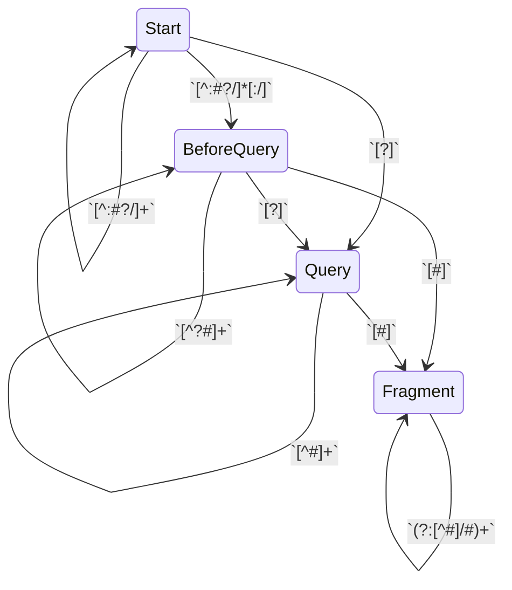

# Safe URL processing

URLs in links are not typically intended to affect the current page.
They may navigate the window or tab, but they cause no change to the
page itself.

But `javascript:` URLs do so it's important to keep them away from
link texts.

HtmlUrlDelegate maintains parsing context for URLs so that we can
effectively identify when an untrusted substitution could cause the
URL's protocol to be something other than typically safe content like
http(s) or mailto.

    export class HtmlUrlDelegate extends ContextDelegate<UrlEscaperContext, HtmlEscaper> & HtmlDelegate {
      private var _state: AutoescState<UrlEscaperContext, HtmlEscaper> = new AutoescState<UrlEscaperContext, HtmlEscaper>(new UrlEscaperContext(0), null);

      public get state(): AutoescState<UrlEscaperContext, HtmlEscaper> { _state }
      public set state(x: AutoescState<UrlEscaperContext, HtmlEscaper>): Void { _state = x; }
      public get sameState(): fn (AutoescState<UrlEscaperContext, HtmlEscaper>, AutoescState<UrlEscaperContext, HtmlEscaper>): Boolean {
        urlStatesEqual
      }

      public get contextPropagator(): ContextPropagator<UrlEscaperContext, HtmlEscaper> {
        urlContextPropagator
      }

      public escaper(outer: HtmlEscaper): HtmlEscaper {
        let inner = when (state.context.urlState) {
          urlStateStart -> htmlProtocolFilteringUrlEscaper;
          urlStateBeforeQuery -> htmlUrlPartUrlEscaper;
          urlStateQuery, urlStateFragment -> htmlAsIfQueryUrlEscaper;
          else -> panic();
        };
        new HtmlUrlEscaperAdapter(inner, outer)
      }

      public toString(): String {
        "HtmlUrlDelegate(${_state})"
      }
    }

## Contexts

UrlEscaperContext captures enough state to allow safe interpolation
into attribute values that have URL content.
It allows distinguishing between interpolations:

- at the start of a URL where attacker content may control the scheme
- into a path part where interpolations control path resolution
- into a query parameter where `=` and `&` are significant meta-characters
- into a fragment

The exact escaper chosen allows for high quality of service in URL composition.

    export class UrlEscaperContext(
      public urlState: Int32,
    ) extends Context {
      public toString(): String { "UrlEscaperContext(${urlStateStr(urlState)})" }
    }

The urlState constants are prefixed with "urlState", a convention relied upon by
the regen_temper scripts.

    /**
     * The state at the start of a URL. Attackers who can inject content here may control the protocol.
     * A common technique is to inject `javascript:badCode()#`, so interpolations here are more heavily
     * filtered than other locations in the URL.
     */
    let urlStateStart = 0;
    /**
     * The state in a URL before a `?` or `#` have been seen.
     * Interpolations here might be URL prefixes with their own queries or fragments,
     * but may just be path parts.
     */
    let urlStateBeforeQuery = 1;
    /**
     * The state in a URL after a `?` has been seen in a trusted portion, but before
     * any `#` has been seen.  Interpolations here are assumed to be query parameter
     * parts, so URL metacharacters (`&`, `#`, `+`, and `%`) are percent-escaped.
     *
     * TODO: An inerpolated iterable of pairs may be encoded as a series of separate URL
     * key-value pairs.
     */
    let urlStateQuery = 2;
    /**
     * The state in a URL after a `#` has been seen in a trusted portion.
     * There are no agreed upon conventions for encoding structured data in a fragment,
     * but we do encoding similar to the query part.
     */
    let urlStateFragment = 3;

## Escapers

HtmlUrlEscaperAdapter allows a UrlEscaper to feed an HtmlEscaper.

    export class HtmlUrlEscaperAdapter(
      public first: UrlEscaper,
      public second: HtmlEscaper,
    ) extends HtmlEscaper {
      @overload("apply")
      public applySafeHtml(x: SafeHtml): String {
        second.applySafeUrl(first.applySafeHtml(x))
      }
      @overload("apply")
      public applySafeUrl(x: SafeUrl): String {
        second.applySafeUrl(first.applySafeUrl(x))
      }
      @overload("apply")
      public applySafeCss(x: SafeCss): String {
        second.applySafeUrl(first.applySafeCss(x))
      }
      @overload("apply")
      public applySafeJs(x: SafeJs): String {
        second.applySafeUrl(first.applySafeJs(x))
      }
      @overload("apply")
      public applyInt32(x: Int32): String {
        second.applySafeUrl(first.applyInt32(x))
      }
      @overload("apply")
      public applyInt64(x: Int64): String {
        second.applySafeUrl(first.applyInt64(x))
      }
      @overload("apply")
      public applyFloat64(x: Float64): String {
        second.applySafeUrl(first.applyFloat64(x))
      }
      @overload("apply")
      public applyString(x: String): String {
        second.applySafeUrl(first.applyString(x))
      }

      public toString(): String { "HtmlUrlEscaperAdapter(${first}, ${second})" }
    }

UrlEscapers are similar to HtmlEscapers but produce SafeUrls.

    export sealed interface UrlEscaper extends Escaper {
      @overload("apply")
      applySafeUrl(x: SafeUrl): SafeUrl;
      @overload("apply")
      applyString(x: String): SafeUrl;
      @overload("apply")
      applySafeCss(x: SafeCss): SafeUrl { applyString(x.text) }
      @overload("apply")
      applySafeJs(x: SafeJs): SafeUrl { applyString(x.text) }
      @overload("apply")
      applySafeHtml(x: SafeHtml): SafeUrl { applyString(x.text) }
      @overload("apply")
      applyInt32(x: Int32): SafeUrl { applyString(x.toString()) }
      @overload("apply")
      applyInt64(x: Int64): SafeUrl { applyString(x.toString()) }
      @overload("apply")
      public applyFloat64(x: Float64): SafeUrl { applyString(x.toString()) }

      toString(): String;
    }

protocolAllowList allows HTTP, HTTPS, and MAILTO urls.
Other URL protocols should be conveyed via *SafeUrl* values.

    let protocolAllowList = rgx"^(?:[Hh][Tt][Tt][Pp][Ss]?|[Mm][Aa][Ii][Ll][Tt][Oo])$";

fallbackSafeUrl is substituted when an unsafe URL prefix is detected.
If you see `about:zz_Temper_zz#` showing up in HTML, it's likely that
an input was rejected.  You can use SafeUrl to convey URLs that you
generate safely which need to be output as-is.

    let fallbackSafeUrl = new SafeUrl("about:zz_Temper_zz#");

HtmlProtocolFilteringUrlEscaper checks its input for a protocol.
If there is no protocol, or there is one in the protocolAllowList, it
does minimal work.  Otherwise it substitutes fallbackSafeUrl.

    export class HtmlProtocolFilteringUrlEscaper extends UrlEscaper {
      public static instance = new HtmlProtocolFilteringUrlEscaper();
      @overload("apply")
      public applySafeUrl(x: SafeUrl): SafeUrl { x }
      @overload("apply")
      public applyString(x: String): SafeUrl {
        var i = String.begin;
        let end = x.end;
        while (i < end) {
          let cp = x[i];
          if (cp == char':') {
            let protocol = x.slice(String.begin, i);
            if ((protocolAllowList.find(protocol) orelse null) == null) {
              return fallbackSafeUrl;
            }
          }
          // If we see a '.' or '[' we don't encode ':'.
          // This lets us avoid protocol merge hazards while allowing
          // host-ports and IPv6 addresses through unchanged.
          if (cp == char'.' || cp == char'[') { break; }

          i = x.next(i);
        }
        // No protocol, just process it as string content.
        htmlUrlPartUrlEscaper.applyString(x)
      }
      public toString(): String { "HtmlProtocolFilteringUrlEscaper" }
    }
    let htmlProtocolFilteringUrlEscaper = doPure { (): HtmlProtocolFilteringUrlEscaper =>
      new HtmlProtocolFilteringUrlEscaper()
    };

    /**
     * We %-escape every ASCII codepoint but
     * - letters and digits [A-Za-z0-9]
     * - path separators, dots, dashes, underscores
     */
    let urlQuerySafe: List = do {
      let lb = new ListBuilder<Boolean>();
      for (var i = 0; i < 128; ++i) {
        lb.add(
          i == char'/' || i == char'.' || i == char'-' || i == char'_' ||
          char'0' <= i && i <= char'9' || char'a' <= (i | 32) && (i | 32) <= char'z'
        );
      }
      lb.toList()
    };
    /**
     * Outside of a query or fragment we also allow common HTML metacharacters:
     * '#', '&', ':', '=', '?', '[', and ']'.
     *
     * We do not allow ',' because it is a meta-characer in `srcset`s.
     * That allows embedding full URL prefixes in a string.
     */
    let urlSafe: List<Boolean> = do {
      let lb = new ListBuilder<Boolean>();
      for (var i = 0; i < 128; ++i) {
        lb.add(
          urlQuerySafe[i] || i == char'#' || i == char'&' || i == char':' ||
          i == char'=' || i == char'?' || i == char'[' || i == char']'
        );
      }
      lb.toList()
    }

HtmlUrlPartUrlEscaper is for interpolations into a URL where they're not obviously
in a query or fragment part.

    export class HtmlUrlPartUrlEscaper extends UrlEscaper {
      public static instance = new HtmlUrlPartUrlEscaper();
      @overload("apply")
      public applySafeUrl(x: SafeUrl): SafeUrl { x }
      @overload("apply")
      public applyString(x: String): SafeUrl {
        var i = String.begin;
        let end = x.end;
        var emitted = String.begin;
        let sb = new StringBuilder();
        while (i < end) {
          let cp = x[i];
          if (cp < urlSafe.length && !urlSafe[cp]) {
            sb.appendBetween(x, emitted, i);
            percentEscapeOctetTo(cp, sb);
            emitted = x.next(i);
          }
          i = x.next(i);
        }
        new SafeUrl(
          if (emitted > String.begin) {
            sb.appendBetween(x, emitted, end);
            sb.toString()
          } else {
            x
          }
        )
      }
      public toString(): String { "HtmlUrlPartUrlEscaper" }
    }
    let htmlUrlPartUrlEscaper = doPure { (): HtmlUrlPartUrlEscaper => new HtmlUrlPartUrlEscaper() };

    export class HtmlAsIfQueryUrlEscaper extends UrlEscaper {
      public static instance = new HtmlAsIfQueryUrlEscaper();
      @overload("apply")
      public applySafeUrl(x: SafeUrl): SafeUrl { x }
      @overload("apply")
      public applyString(x: String): SafeUrl {
        var i = String.begin;
        let end = x.end;
        var emitted = String.begin;
        let sb = new StringBuilder();
        while (i < end) {
          let cp = x[i];
          if (cp < urlQuerySafe.length && !urlQuerySafe[cp]) {
            sb.appendBetween(x, emitted, i);
            percentEscapeOctetTo(cp, sb);
            emitted = x.next(i);
          }
          i = x.next(i);
        }
        new SafeUrl(
          if (emitted > String.begin) {
            sb.appendBetween(x, emitted, end);
            sb.toString()
          } else {
            x
          }
        )
      }
      public toString(): String { "HtmlAsIfQueryUrlEscaper" }
    }
    let htmlAsIfQueryUrlEscaper = doPure { (): HtmlAsIfQueryUrlEscaper => new HtmlAsIfQueryUrlEscaper() };

## URL Transition table

<!-- TRANSITION_TABLE: Url; urlState -->

| In                    | Regex                | Substitution | Out         |
| --------------------- | -------------------- | ------------ | ----------- |
| Start                 | `[^:#?\/]*[:\/]`     |              | BeforeQuery |
| Start                 | `[^:#?\/]+`          |              | _           |
| Start                 | `[?]`                |              | Query       |
| _                     | `[#]`                |              | Fragment    |
| BeforeQuery           | `[^?#]+`             |              | _           |
| BeforeQuery           | `[?]`                |              | Query       |
| BeforeQuery           | `[#]`                |              | Fragment    |
| Query                 | `[^#]+`              |              | _           |
| Query                 | `[#]`                |              | Fragment    |
| Fragment              | `(?:[^#]/#)+`        |              | _           |
| _                     | ${}                  |              | _           |

<!-- /TRANSITION_TABLE -->

<!-- GENERATED_TRANSITION_DIAGRAM: Url; urlState -->

<!-- /GENERATED_TRANSITION_DIAGRAM -->
